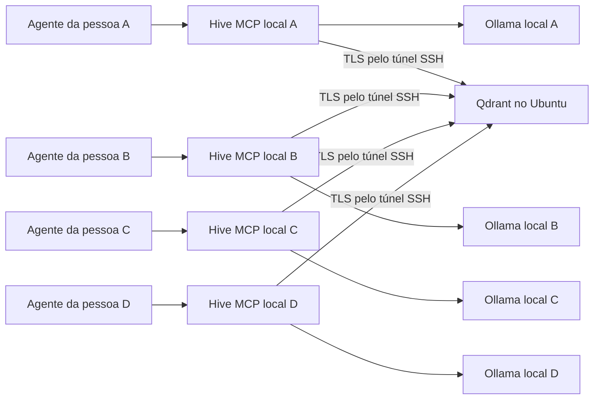

# Hive Mind: servidor Ubuntu 24.04 e teste com quatro pessoas

Roteiro preparado em 18/09/2026 para a implementação atual. O servidor remoto ainda precisa ser configurado por você; este documento não representa uma implantação já executada.

Servidor recém-criado? Comece por [instalar os requisitos no Ubuntu 24.04](PREPARAR_SERVIDOR_UBUNTU_24_04.md) e depois retome este guia na seção 4.

## 1. Como vai funcionar

**Suba um Qdrant compartilhado no servidor. Cada pessoa executa seu próprio Hive Mind/MCP e Ollama no computador dela.** O agente inicia o MCP local e consulta o mesmo banco dos colegas.



O projeto usa MCP por **stdio**, a comunicação entre o agente e um processo local. Não existe um serviço MCP HTTP/SSE compartilhado ou uma URL `/mcp` para instalar no servidor nesta versão. Para testar sozinho primeiro, prepare o banco e apenas o cliente da pessoa A; depois acrescente os outros três.

| Local | O que instalar/manter |
| --- | --- |
| Servidor Ubuntu | Docker + Compose, Qdrant persistente, certificados TLS, helper administrativo e acesso SSH. |
| Computador de cada pessoa | Binário Hive Mind, Ollama com o mesmo modelo, cliente de IA com MCP stdio, túnel SSH e credencial individual. |
| Computador de cada writer | Pasta própria de documentos e pasta separada de auditoria. |

Não precisa criar outro projeto de código. No servidor você pode copiar **somente dois arquivos de implantação** deste repositório. Nos computadores, o código serve para compilar o binário; os dados do ensaio ficam em uma pasta nova, fora do repositório. Assim, o acervo antigo, incluindo Coinspot, não entra no teste.

O servidor armazena os trechos publicados, vetores e metadados. Outra pessoa consegue consultar esses trechos sem receber uma cópia dos seus arquivos. Os originais e os documentos convertidos continuam no computador de quem os publicou e precisam ser preservados.

Os quatro participantes deste roteiro serão writers confiáveis. Cada um possui identidade, token e documentos próprios. Um JWT `rw` permite acesso direto às duas collections inteiras: regras de programa/classificação/propriedade são aplicadas pelo Hive, não constituem isolamento entre pessoas hostis. Use collections separadas quando as equipes não puderem acessar os mesmos dados.

## 2. Nomes que usaremos

| Item | Valor do ensaio |
| --- | --- |
| Projeto Docker | `hive-server` |
| Hive | `hive-teste-4p` |
| Collection de documentos | `hive_teste_4p` |
| Collection de controle | `hive_teste_4p__control` |
| Collection administrativa de revogação | `hive_device_access` |
| Programa sintético inicial | `teste-ingestao` |
| Dispositivos | `ana-laptop`, `bruno-laptop`, `carla-laptop`, `diego-laptop` |
| Contas SSH de túnel | `hive-ana`, `hive-bruno`, `hive-carla`, `hive-diego` |
| Porta local do túnel, em cada computador | `16334` |

Troque os nomes das pessoas se desejar, mantendo a correspondência entre conta SSH, token, dispositivo e nome dos arquivos. Substitua `IP_DO_SERVIDOR` e `USUARIO_ADMIN` nos comandos pelos valores do provedor. `USUARIO_ADMIN` é sua conta administrativa existente, com sudo; ela é diferente das quatro contas de túnel.

## 3. Servidor: instalar os requisitos

**Onde executar: no servidor, conectado por SSH com sua conta administrativa.**

```bash
sudo apt-get update
sudo apt-get install -y ca-certificates curl python3 openssl openssh-server
```

Se Docker Engine e `docker compose` já estiverem instalados e funcionando, pule sua instalação. Em um Ubuntu 24.04 novo:

```bash
sudo install -d -m 0755 /etc/apt/keyrings
sudo curl -fsSL https://download.docker.com/linux/ubuntu/gpg -o /etc/apt/keyrings/docker.asc
sudo chmod a+r /etc/apt/keyrings/docker.asc
```

Crie `/etc/apt/sources.list.d/docker.sources` com `sudoedit`. Para servidor **amd64**, use:

```text
Types: deb
URIs: https://download.docker.com/linux/ubuntu
Suites: noble
Components: stable
Architectures: amd64
Signed-By: /etc/apt/keyrings/docker.asc
```

Confira a arquitetura com `dpkg --print-architecture`; se retornar `arm64`, use `Architectures: arm64`. Depois:

```bash
sudo apt-get update
sudo apt-get install -y docker-ce docker-ce-cli containerd.io docker-buildx-plugin docker-compose-plugin
sudo systemctl enable --now docker
sudo docker version
sudo docker compose version
timedatectl status
```

O relógio deve estar sincronizado para a validade dos tokens. Referência e tratamento de instalações Docker preexistentes: [Docker Engine no Ubuntu](https://docs.docker.com/engine/install/ubuntu/).

## 4. Enviar somente a implantação ao servidor

**Onde executar: no seu computador, na raiz deste repositório.**

```bash
git rev-parse HEAD > /tmp/hive-test-revision.txt
tar -czf /tmp/hive-server-test.tar.gz \
  deploy/qdrant-server.compose.yml \
  deploy/qdrant_admin.py
scp -i ~/.ssh/hive_servidor \
  /tmp/hive-server-test.tar.gz /tmp/hive-test-revision.txt \
  USUARIO_ADMIN@IP_DO_SERVIDOR:~/
```

Isso não envia `hive-data`, `.env.hive`, tokens locais, logs nem seu banco atual. Se a chave SSH tiver outro nome, ajuste `-i`.

**No servidor, como sua conta administrativa:**

```bash
sudo install -d -m 0755 /opt/hive-test
sudo tar -xzf "$HOME/hive-server-test.tar.gz" -C /opt/hive-test
sudo install -m 0644 "$HOME/hive-test-revision.txt" /opt/hive-test/revision.txt
sudo -i
cd /opt/hive-test
umask 077
python3 deploy/qdrant_admin.py init
```

Você agora está em uma sessão root. Os próximos passos administrativos no servidor usam essa sessão. O helper cria `/srv/hive-private/admin.key` e `qdrant.env` privados. Ele recusa sobrescrever uma instalação existente.

## 5. Servidor: TLS e inicialização do Qdrant

**Onde executar: servidor, sessão root, em `/opt/hive-test`.**

```bash
install -d -m 700 /srv/hive-private/tls
openssl req -x509 -newkey rsa:3072 -nodes -sha256 -days 3650 \
  -keyout /srv/hive-private/ca.key -out /srv/hive-private/ca.crt \
  -subj '/CN=Hive Test CA' \
  -addext 'basicConstraints=critical,CA:TRUE' \
  -addext 'keyUsage=critical,keyCertSign,cRLSign'
openssl req -new -newkey rsa:3072 -nodes -sha256 \
  -keyout /srv/hive-private/tls/server.key \
  -out /srv/hive-private/server.csr -subj '/CN=qdrant.hive.internal' \
  -addext 'subjectAltName=DNS:qdrant.hive.internal,IP:127.0.0.1' \
  -addext 'basicConstraints=critical,CA:FALSE' \
  -addext 'extendedKeyUsage=serverAuth'
openssl x509 -req -in /srv/hive-private/server.csr \
  -CA /srv/hive-private/ca.crt -CAkey /srv/hive-private/ca.key \
  -CAcreateserial -out /srv/hive-private/tls/server.crt \
  -days 90 -sha256 -copy_extensions copy
chmod 600 /srv/hive-private/ca.key /srv/hive-private/tls/server.key
openssl verify -CAfile /srv/hive-private/ca.crt /srv/hive-private/tls/server.crt
docker compose -p hive-server -f deploy/qdrant-server.compose.yml config --quiet
docker compose -p hive-server -f deploy/qdrant-server.compose.yml up -d
docker compose -p hive-server -f deploy/qdrant-server.compose.yml ps
ss -lnt
```

Os comandos de geração de certificados são de primeira instalação; não os repita para reiniciar o serviço. `qdrant.hive.internal` é o nome de verificação TLS: o cliente conectará por IP local e indicará esse nome, sem exigir domínio público ou registro DNS.

O Compose fixa Qdrant `v1.18.3`, habilita TLS/JWT e publica `6333` e `6334` apenas em `127.0.0.1`. No firewall do provedor, permita SSH às origens das pessoas autorizadas. As portas `6333`, `6334`, `6335` e `11434` não precisam de entrada pública. Preserve seu acesso administrativo ao alterar regras.

Não use o `docker-compose.yml` da raiz para esse servidor: o arquivo de `deploy/` é a implantação selecionada e não sobe Ollama nem MCP. Não execute `down -v`, pois removeria os volumes. A configuração TLS segue a [documentação do Qdrant](https://qdrant.tech/documentation/security/#tls).

## 6. Primeiro computador: binário e modelo

**Onde executar: computador da primeira pessoa.** Os comandos de instalação abaixo consideram cliente Ubuntu/Linux; macOS usa os mesmos diretórios relativos a `$HOME`, mas requer suas próprias instalações de Go, Python e Ollama.

Requisitos: Go **1.25 ou superior**, compilador C/C++, Python **3.11 ou superior**, OpenSSH client e Ollama. No Ubuntu:

```bash
sudo apt-get update
sudo apt-get install -y build-essential git python3 openssh-client curl
```

Instale Go pelo [procedimento oficial](https://go.dev/doc/install) se `go version` não atender ao requisito. Não suponha que a versão de `golang-go` do Ubuntu 24.04 seja suficiente. Para Ollama ainda não instalado, baixe, revise e execute o instalador conforme a [documentação Linux](https://docs.ollama.com/linux):

```bash
curl -fsSL https://ollama.com/install.sh -o /tmp/hive-ollama-install.sh
less /tmp/hive-ollama-install.sh
sh /tmp/hive-ollama-install.sh
sudo systemctl enable --now ollama
```

Se Ollama já estiver rodando, use a instalação existente. Na raiz da cópia local do projeto:

```bash
go version
python3 --version
git rev-parse HEAD
go build -trimpath -o bin/hive-mind .
umask 077
mkdir -p "$HOME/hive-teste/bin" "$HOME/hive-teste/config" \
  "$HOME/hive-teste/data/programs/teste-ingestao/imports" \
  "$HOME/hive-teste/raw" "$HOME/hive-teste/audit" "$HOME/hive-teste/reports"
install -m 0755 bin/hive-mind "$HOME/hive-teste/bin/hive-mind"
ollama pull nomic-embed-text
ollama list
curl -fsS http://127.0.0.1:11434/api/embed \
  -H 'Content-Type: application/json' \
  -d '{"model":"nomic-embed-text","input":"hive dimension probe"}' \
  | python3 -c 'import json,sys; print("dimension:",len(json.load(sys.stdin)["embeddings"][0]))'
curl -fsS http://127.0.0.1:11434/api/tags \
  | python3 -c 'import json,sys; print(json.dumps([{k:m[k] for k in ("name","digest")} for m in json.load(sys.stdin)["models"]],indent=2))'
```

Anote a dimensão e o digest do `nomic-embed-text`. As quatro pessoas precisam do mesmo modelo/digest e da mesma revisão do Hive. A tag pode mudar entre downloads; compare os digests e resolva diferenças antes de usar a mesma collection. Preserve o artefato aprovado. `validate` verifica a compatibilidade.

As outras pessoas podem obter o mesmo código via repositório e compilar, ou receber um binário compilado para o mesmo SO/arquitetura e runtime C compatível. Não é necessário distribuir o acervo do repositório. Um binário Linux não serve para macOS.

## 7. Servidor: criar as collections vazias e quatro credenciais

**Onde executar: servidor, sessão root, em `/opt/hive-test`.** Substitua `768` pela dimensão medida no passo anterior, caso seja diferente.

```bash
python3 deploy/qdrant_admin.py --collection hive_teste_4p provision --dimension 768
```

São criadas as três collections da seção 2. O comando valida coleções existentes e não as esvazia. Este roteiro usa um nome novo para não compartilhar o banco do laboratório anterior.

Emita os quatro tokens, aqui com validade de 24 horas para o primeiro teste:

```bash
for pessoa in ana bruno carla diego; do
  python3 deploy/qdrant_admin.py --collection hive_teste_4p issue \
    --device-id "${pessoa}-laptop" --role writer --hours 24 \
    --output "/srv/hive-private/${pessoa}-laptop.jwt"
done
openssl x509 -in /srv/hive-private/ca.crt -noout -fingerprint -sha256
```

Guarde os IDs de token e as validades retornados, sem copiar o token para relatórios. Entregue individualmente a cada pessoa **seu JWT e `ca.crt`**, por canal privado. A impressão digital da CA deve ser confirmada por canal confiável.

No computador de cada pessoa, salve:

```text
~/hive-teste/config/writer.jwt  ← somente o token dessa pessoa
~/hive-teste/config/ca.crt      ← certificado público da CA do servidor
```

A chave administrativa, `qdrant.env`, `ca.key` e `server.key` ficam no servidor. As chaves privadas SSH ficam com seus respectivos donos. As contas de túnel da próxima seção não permitem SFTP; a entrega inicial de credenciais é feita pelo operador pelo canal privado, não por essas contas.

## 8. Servidor: contas para os quatro túneis SSH

**Onde executar: servidor, sessão root.** Na primeira instalação:

```bash
groupadd hive-tunnel
for pessoa in ana bruno carla diego; do
  adduser --disabled-password --gecos '' "hive-${pessoa}"
  usermod -aG hive-tunnel "hive-${pessoa}"
  install -d -m 700 -o "hive-${pessoa}" -g "hive-${pessoa}" \
    "/home/hive-${pessoa}/.ssh"
  install -m 600 -o "hive-${pessoa}" -g "hive-${pessoa}" /dev/null \
    "/home/hive-${pessoa}/.ssh/authorized_keys"
done
```

Esses comandos pressupõem contas novas; não recrie `authorized_keys` de contas existentes. Edite cada arquivo e adicione a chave pública da pessoa correspondente. Não adicione essas contas ao grupo Docker ou sudo. Sua conta administrativa permanece separada.

Crie `/etc/ssh/sshd_config.d/60-hive-tunnels.conf`:

```text
Match Group hive-tunnel
    AuthenticationMethods publickey
    PasswordAuthentication no
    AllowTcpForwarding local
    AllowStreamLocalForwarding no
    PermitOpen 127.0.0.1:6334
    AllowAgentForwarding no
    X11Forwarding no
    PermitTTY no
    PermitTunnel no
    GatewayPorts no
    MaxSessions 0
Match all
```

Valide e recarregue mantendo sua sessão administrativa aberta:

```bash
sshd -t
systemctl reload ssh
```

Só recarregue se `sshd -t` terminar sem erro. Confira também regras preexistentes do provedor, como `AllowUsers` ou `DisableForwarding`, se o túnel for recusado. `MaxSessions 0` permite encaminhamento, mas impede shell/SFTP nas contas desse grupo, conforme o [manual do OpenSSH](https://man.openbsd.org/sshd_config#MaxSessions).

## 9. Cada computador: abrir o túnel

**Onde executar: computador de cada pessoa.** Exemplo para Ana:

```bash
ssh -i ~/.ssh/hive_servidor -N -T \
  -o ExitOnForwardFailure=yes \
  -o ServerAliveInterval=30 -o ServerAliveCountMax=3 \
  -L 127.0.0.1:16334:127.0.0.1:6334 \
  hive-ana@IP_DO_SERVIDOR
```

Confira a chave de host na primeira conexão pelo painel/console do servidor. Mantenha esse terminal aberto; não aparecerá um shell, o que é esperado. Bruno usa `hive-bruno` e sua própria chave, e assim por diante. Todos podem usar a porta local `16334`, pois estão em computadores diferentes.

O endereço `https://127.0.0.1:16334` nos clientes significa **Qdrant remoto pelo túnel**, não o banco local antigo em `6334`.

## 10. Cada computador: configuração isolada do teste

Repita a preparação de binário, pastas e Ollama da seção 6 nos demais computadores. Após receber `writer.jwt` e `ca.crt`, execute:

```bash
chmod 700 "$HOME/hive-teste/config"
chmod 600 "$HOME/hive-teste/config/writer.jwt" "$HOME/hive-teste/config/ca.crt"
```

Crie o TOML abaixo automaticamente. **Troque `ana-laptop` em cada computador**:

```bash
HIVE_TEST_DEVICE=ana-laptop python3 - <<'PY'
import json, os
from pathlib import Path
root = Path.home() / 'hive-teste'
device = os.environ['HIVE_TEST_DEVICE']
values = {
    'HIVE_ID': 'hive-teste-4p',
    'HIVE_DEVICE_ID': device,
    'HIVE_ROLE': 'writer',
    'HIVE_WRITER_APPROVAL_ID': 'teste-001-' + device,
    'HIVE_COLLECTION': 'hive_teste_4p',
    'HIVE_DATA_DIR': str(root / 'data'),
    'HIVE_AUDIT_DIR': str(root / 'audit'),
    'QDRANT_URL': 'https://127.0.0.1:16334',
    'QDRANT_TLS_CA_FILE': str(root / 'config/ca.crt'),
    'QDRANT_TLS_SERVER_NAME': 'qdrant.hive.internal',
    'OLLAMA_URL': 'http://127.0.0.1:11434',
    'EMBEDDING_MODEL': 'nomic-embed-text',
    'HIVE_MAX_CLASSIFICATION': 'internal',
}
path = root / 'config/hive.toml'
with path.open('x') as out:
    for key, value in values.items():
        out.write(key + ' = ' + json.dumps(value, ensure_ascii=False) + '\n')
path.chmod(0o600)
print('Configuração criada em', path)
PY
```

O token fica no arquivo privado separado. O launcher a seguir lê os dois arquivos e remove variáveis antigas do Hive herdadas do terminal ou do cliente de IA. Isso evita que uma `.env.hive` carregada anteriormente direcione o teste para o banco/acervo errado.

Crie `~/hive-teste/bin/hive-teste` com este conteúdo:

```python
#!/usr/bin/env python3
import os
import sys
import tomllib
from pathlib import Path

root = Path(__file__).resolve().parent.parent
config = root / 'config/hive.toml'
token_file = root / 'config/writer.jwt'
for path in (config, token_file):
    if path.stat().st_mode & 0o077:
        raise SystemExit('Aplique chmod 600 a ' + str(path))
values = tomllib.loads(config.read_text())
legacy = {'WATCH_DIRECTORY', 'QDRANT_COLLECTION', 'QDRANT_HOST', 'QDRANT_PORT', 'OLLAMA_HOST'}
env = {k: v for k, v in os.environ.items()
       if not k.startswith(('HIVE_', 'QDRANT_', 'OLLAMA_'))
       and k != 'EMBEDDING_MODEL' and k not in legacy}
env.update({k: str(v) for k, v in values.items()})
env['QDRANT_API_KEY'] = token_file.read_text().strip()
binary = str(root / 'bin/hive-mind')
os.execve(binary, [binary, *sys.argv[1:]], env)
```

Depois:

```bash
chmod 700 "$HOME/hive-teste/bin/hive-teste"
"$HOME/hive-teste/bin/hive-teste" help
```

Estrutura final em cada computador:

```text
~/hive-teste/
  bin/hive-mind       executável compilado
  bin/hive-teste      launcher com configuração isolada
  config/hive.toml    identidade e caminhos
  config/writer.jwt   credencial individual
  config/ca.crt       CA pública do servidor
  raw/               arquivos crus, fora da pasta observada
  data/programs/     somente documentos destinados à ingestão
  audit/             auditoria local
  reports/           relatórios do teste
```

## 11. Registrar cada writer e validar

**Onde executar: em cada computador, com Ollama e túnel ativos.** A pasta `data` ainda estará vazia de documentos:

```bash
"$HOME/hive-teste/bin/hive-teste" ingest
"$HOME/hive-teste/bin/hive-teste" validate
"$HOME/hive-teste/bin/hive-teste" status
```

A primeira ingestão registra a identidade do writer e inicializa o manifesto de compatibilidade. É esperado `total: 0` nessa etapa. `validate` deve retornar `ok: true`. O `status` deve mostrar `hive-teste-4p`, `hive_teste_4p` e o dispositivo correto. Faça isso com Ana primeiro e depois com os outros.

## 12. Testar arquivo cru → conversão → ingestão → busca

**Onde executar: computador de Ana, antes de conectar o MCP.** Isso permite inspecionar a conversão antes de qualquer watcher publicá-la.

Crie um arquivo sintético de teste; depois substitua por um export real revisado:

```bash
cat > "$HOME/hive-teste/raw/ana-primeiro.csv" <<'CSV'
item,observacao
teste,marcador farol-violeta-427 registrado por Ana
CSV
"$HOME/hive-teste/bin/hive-teste" convert "$HOME/hive-teste/raw/ana-primeiro.csv" \
  --program=teste-ingestao --classification=internal \
  --document-type=note --source=ana-primeiro.csv \
  --output="$HOME/hive-teste/data/programs/teste-ingestao/imports/ana-primeiro.json"
python3 -m json.tool "$HOME/hive-teste/data/programs/teste-ingestao/imports/ana-primeiro.json"
```

Verifique `hive_document_schema: "hive-document/v1"`, `program_id`, `classification`, `source_format`, `raw_hash` e os `blocks` com seus textos/localizadores. Essa saída contém seu conteúdo, portanto inspecione-a localmente.

Depois publique:

```bash
"$HOME/hive-teste/bin/hive-teste" ingest > "$HOME/hive-teste/reports/ana-ingest-1.json"
python3 -m json.tool "$HOME/hive-teste/reports/ana-ingest-1.json"
"$HOME/hive-teste/bin/hive-teste" search teste-ingestao 'farol-violeta-427' --scope-status=unknown
"$HOME/hive-teste/bin/hive-teste" ingest
```

Espere `created: 1` na primeira ingestão e `unchanged: 1` na repetição, sem outros documentos de teste. Se o comando retornar código `15`, examine `summary.results`: houve falha parcial. A busca deve mostrar o trecho com a origem.

**No computador de Bruno**, execute a mesma busca. O marcador deve aparecer mesmo sem copiar `ana-primeiro.json` para ele. Essa é a primeira prova de compartilhamento.

Para um **novo arquivo** e **novo destino**, a opção `--ingest` adicionada ao comando `convert` faz conversão e ingestão em uma execução. Não repita o mesmo `convert --output` sobre um arquivo existente: o conversor recusa sobrescrita. Para reingerir um envelope existente, use `ingest`.

Formatos ativos: MD, TXT, JSON, JSONL/NDJSON, CSV e TSV. PDF, Office, imagens e áudio ainda precisam de extração externa. O padrão é 5 MiB por arquivo e 1.000 chunks; o envelope convertido também precisa caber no limite. Arquivos sem classificação reconhecida podem ser indexados como `unknown`, mas não aparecem na busca. O `convert --classification=internal` resolve essa classificação para o exemplo.

O programa sintético permanece com escopo `unknown`. Isso permite o teste de memória, sem conceder autorização sobre ativos. Para programas reais, uma pessoa responsável por programa deve preparar, revisar e aprovar `scope.json` pelo [procedimento de escopo](docs/spec/contracts/scope-manifest.md).

## 13. Conectar uma instância MCP em cada cliente

Agora conecte o cliente de IA ao launcher. Em um cliente que use a estrutura `mcpServers`, o exemplo de Ana é:

```json
{
  "mcpServers": {
    "hive-teste": {
      "command": "/home/ana/hive-teste/bin/hive-teste",
      "args": []
    }
  }
}
```

Use o caminho absoluto real de cada pessoa; no macOS começará normalmente com `/Users/...`. O formato do arquivo de configuração depende do cliente, mas o transporte é **stdio**, o comando é o launcher e os argumentos estão vazios. O cliente precisa encontrar Python 3.11+ para executar o launcher; se necessário, use o caminho absoluto desse Python como `command` e o caminho do launcher como primeiro argumento.

O cliente inicia o processo. Não adicione `serve`, `ingest` ou uma URL HTTP. Túnel SSH e Ollama precisam estar ativos antes da conexão. Prefira um único MCP writer por identidade/pasta, para não duplicar watchers. Reinicie a conexão após alterar credenciais/configuração.

Ferramentas esperadas: `hive_search`, `hive_get_context`, `get_sync_status`, `ingest_workspace`. Peça ao agente:

> Consulte o Hive no programa teste-ingestao e encontre farol-violeta-427. Mostre o trecho e sua origem.

Os argumentos de `hive_search` são:

```json
{"program_id":"teste-ingestao","query":"farol-violeta-427","limit":5}
```

Para ingestão pelo MCP, peça:

> Execute ingest_workspace e mostre o relatório por arquivo, incluindo os erros.

Os argumentos são `{}`. Essa ferramenta varre **toda a pasta `~/hive-teste/data`**; não recebe arquivo ou programa. Ela não possui um conversor de arquivo cru exposto como ferramenta própria. A conversão explícita continua pela CLI, conforme a seção 12.

Com o MCP writer conectado, o watcher pode ingerir o JSON assim que ele entrar em `data`. Se quiser revisar antes de publicar, converta primeiro para um caminho novo dentro de `raw`, confira o JSON e só então mova o arquivo completo para `data/programs/teste-ingestao/imports/`. Por estarem na mesma árvore/disco, o movimento local pode ser atômico; em seguida chame `ingest_workspace` para reconciliar mesmo se o evento de movimento não for observado. `unchanged` pode significar que o watcher já publicou o arquivo.

## 14. Acrescentar as outras pessoas e conferir o ensaio

Repita as seções 6, 9, 10, 11 e 13 para Bruno, Carla e Diego. Cada pessoa cria um documento com prefixo próprio e marcador diferente. Os caminhos publicados precisam ser distintos, por exemplo `ana-primeiro.json` e `bruno-primeiro.json`.

| Verificação | Resultado esperado |
| --- | --- |
| Os quatro executam `validate` | `ok: true`, cada qual com seu dispositivo. |
| Cada pessoa publica uma nota | Relatório confirma publicação ou mostra `unchanged` se o watcher já publicou. |
| Cada pessoa busca os quatro marcadores | Vê os quatro sem copiar arquivos dos colegas. |
| Reingerir arquivo sem mudanças | `unchanged`; não é contado como novo documento. |
| Dois writers tentam publicar o mesmo path | O segundo recebe `skipped`/`foreign_writer`, sem sobrescrever. |
| Desligar o computador de Ana | Notas já publicadas continuam consultáveis pelos outros; novas alterações de Ana não são sincronizadas. |
| Conferir o diretório de ingestão | Somente o acervo novo do ensaio, sem programas do laboratório antigo. |

Para testar também o papel reader, emita um token adicional com `--role reader`, configure uma identidade separada com `HIVE_ROLE=reader` e remova `HIVE_DATA_DIR`/`HIVE_WRITER_APPROVAL_ID`. Use outra configuração/launcher; não troque o papel de um writer já registrado. A ingestão deve ser negada e `ingest_workspace` não deve aparecer no MCP reader.

Depois da calibração, siga o [ensaio de quatro pessoas](docs/operations/four-person-trial.md): dois grupos, dois programas autorizados e troca de contexto. Exporte `audit report` de cada computador; a auditoria é local, não centralizada automaticamente no servidor.

```bash
"$HOME/hive-teste/bin/hive-teste" audit report --since=2026-09-18 \
  > "$HOME/hive-teste/reports/uso.json"
```

Ajuste a data ao início do seu teste. Compare também os tokens das sessões no cliente de IA: os contadores de caracteres do Hive não são uma medição exata de tokens.

## 15. No dia seguinte: iniciar, renovar e verificar

O Qdrant reinicia com Docker pelo `restart: unless-stopped`. Em cada computador, abra o túnel, confira Ollama e conecte o MCP. Não precisa executar `ingest` para consultar notas já publicadas.

Os JWTs deste roteiro expiram em 24 horas. Para renovar Ana, **no servidor**:

```bash
cd /opt/hive-test
python3 deploy/qdrant_admin.py --collection hive_teste_4p issue \
  --device-id ana-laptop --role writer --hours 24 \
  --output /srv/hive-private/ana-laptop-renovacao-01.jwt
```

Entregue o token novo, substitua o conteúdo do `writer.jwt` local, mantenha modo `0600`, reinicie o MCP e execute `validate`. Preserve o mesmo device ID e approval ID. Depois revogue o token antigo pelo ID registrado na emissão:

```bash
python3 deploy/qdrant_admin.py --collection hive_teste_4p revoke \
  --device-id ana-laptop --token-id UUID_DO_TOKEN_ANTIGO
```

O helper aceita de 1 a 168 horas; ajuste a duração ao ensaio e planeje as renovações. Emitir um token novo não revoga o antigo. A revogação individual usa a claim `value_exists` documentada pelo [Qdrant](https://qdrant.tech/documentation/security/#jwt-configuration).

Para retirar totalmente uma pessoa, revogue seus tokens, remova sua chave pública da conta de túnel e encerre as conexões SSH já abertas dessa conta. Confirme que outra pessoa continua funcionando. Os documentos publicados permanecem até uma remoção explícita.

No servidor, para acompanhar ou reiniciar:

```bash
cd /opt/hive-test
docker compose -p hive-server -f deploy/qdrant-server.compose.yml ps
docker compose -p hive-server -f deploy/qdrant-server.compose.yml logs --tail 100 qdrant
docker compose -p hive-server -f deploy/qdrant-server.compose.yml restart qdrant
```

O certificado TLS deste roteiro vence em 90 dias. Renove antes do vencimento; não regenere a CA a cada reinício. Mantenha documentos e backup fora do servidor antes de usar dados insubstituíveis. O [runbook de backup](docs/operations/backup-recovery.md) cobre o par dados/controle; preserve também separadamente a collection `hive_device_access` e os segredos administrativos necessários à recuperação dessa implantação. Volume persistente não é backup.

## 16. Diagnóstico rápido

| Sintoma | O que conferir |
| --- | --- |
| Código `10` | Configuração, caminhos absolutos, permissões e pastas existentes. |
| Código `11` | Túnel aberto, Ollama local e Qdrant no servidor. |
| Código `12` | Token expirado/revogado, papel, collection ou registro do writer. |
| Código `13` | CA correta, nome TLS e validade do certificado. |
| Código `14` | Modelo/digest/dimensão ou fingerprint diferente do primeiro writer. |
| Código `15` | Relatório de falha parcial; examinar motivos por arquivo. |
| `Address already in use` ao abrir túnel | Porta local `16334` ocupada; use outra e ajuste `QDRANT_URL`. |
| `administratively prohibited` no SSH | Conta/grupo, `PermitOpen` e políticas SSH do provedor. |
| Conversão recusa destino | `--output` já existe; inspecione-o e use `ingest` ou escolha outro arquivo novo. |
| Ingeriu, mas não aparece | Classificação, programa, filtros, limites e sucesso da publicação. |
| `tomllib` não encontrado | Launcher requer Python 3.11 ou superior. |
| MCP não conecta, mas CLI funciona | Caminho absoluto, Python no ambiente do aplicativo e processo/túnel ativos. |

Este roteiro prepara o laboratório e os testes iniciais. O aceite operacional completo continua dependente da execução real, incluindo compartilhamento entre máquinas, revogação e restauração. O [guia canônico de servidor](docs/operations/server-multiuser-guide.md) detalha a implantação geral.
