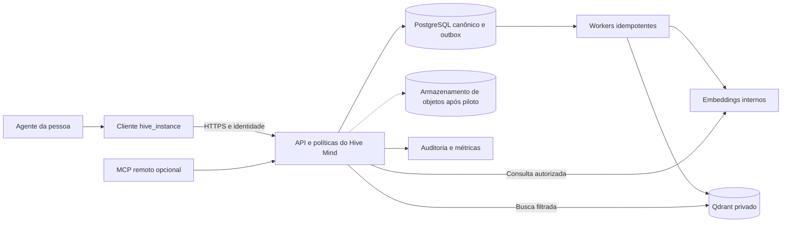

# Plano de melhoria e limpeza do Hive Mind

Data: 2026-09-29. Escopo: organização do checkout, inspeção do código/configuração local e proposta de evolução comercial. As mudanças de organização descritas abaixo são desta revisão; os serviços propostos continuam pendentes. A configuração foi inspecionada sem publicar credenciais. Não foi realizada consulta ao servidor de produção, deploy, alteração de collection ou reescrita do histórico Git.

## 1. Direção do produto e responsabilidade de cada projeto

O `hive_mind` é o repositório de engenharia do cliente/núcleo atual: código, contratos, testes, build e release. Hoje agentes operacionais usam o cliente instalado no `hive_instance`; na distribuição comercial, o comprador receberá um pacote instalável. A API proposta terá projeto e deploy separados. Conhecimento real de programas e configurações de pessoas não pertencem ao checkout de desenvolvimento.

### Decisão prioritária para a próxima evolução

**Recomendação: trocar o acesso direto dos computadores ao Qdrant por uma API Hive autenticada via HTTPS, mantendo o MCP `stdio` e o mini-CLI no computador.** O cliente deve passar a falar só com a API. Assim, adicionar uma pessoa deixa de exigir cadastrar sua chave SSH no host, entregar um JWT do Qdrant ou distribuir manualmente a CA de confiança usada hoje. O servidor continua dono do Qdrant e passa a decidir identidade, permissão, ingestão e busca. Não basta expor o Qdrant na internet ou automatizar a cópia dos três arquivos atuais; isso preservaria o acoplamento que dificulta operar muitos clientes.

**Direção confirmada pelo operador:** a HIVE é um ecossistema hospedado. O caçador paga pela participação, usa as ferramentas e contribui para uma memória cumulativa que permanece na HIVE após sua saída. O produto inicial não é uma instância ou um silo de conhecimento por cliente. O valor da rede cresce quando notas aprovadas viram conhecimento reutilizável pelos demais membros. Cobrança e acesso se vinculam à pessoa/membro; equipes e organizações podem existir como agrupamentos comerciais futuros, sem definir a fronteira principal do acervo.

**Proposta de valor inicial:** o membro entra em um ambiente de trabalho com busca e contexto do acervo geral, usa o mini-CLI/integração com agente, registra seu trabalho nos programas para os quais tem acesso e recebe de volta métodos e aprendizados curados de toda a comunidade. Cada contribuição tem autoria, origem e estado visível; a curadoria reduz duplicações, corrige erros e promove somente o que pode ser reutilizado. Medir participação e consultas úteis evita que o crescimento do número de documentos seja confundido com crescimento do valor do produto.

**Próxima entrega de engenharia:** implementar no projeto irmão `hive_center` o login web, a identidade e a situação do membro, antes de conectar Qdrant. O contrato e a jornada verificável estão em [Primeira entrega da API: login e estado de membro](../hive_center/docs/first-login-slice.md). A pessoa se autentica, aparece como pendente, o operador a ativa e uma suspensão corta o acesso numa sessão já aberta. Pagamento, programas, busca e ingestão entram em incrementos posteriores.

O recorte vendável não precisa começar com deduplicação semântica, Dojo ou MCP remoto. Precisa admitir contribuições no acervo central com proveniência e revisão, permitir revogação de membros, restaurar dados e levar uma pessoa nova à primeira consulta sem intervenção manual no sistema operacional do servidor. O conhecimento geral aprovado é compartilhado com os membros; material de programa fica visível apenas a quem tem autorização para aquele programa. Essa fronteira evita que a assinatura da HIVE seja confundida com autorização para pesquisar um alvo ou divulgar relatórios. Para reduzir componentes no piloto, documentos admitidos e suas revisões podem ficar no PostgreSQL com limites explícitos; armazenamento de objetos entra ao superar os limites medidos. O Qdrant passa a ser um índice derivado.

| Local | Responsabilidade | O que não deve ficar nele |
| --- | --- | --- |
| `hive_mind` | Implementar e testar cliente/núcleo, manter contratos e publicar releases verificáveis. | Acervo real, tokens, laboratório operacional ativo, logs ou backup de clientes. |
| `hive_instance` | Instalar o cliente, integrar o agente, manter configuração privada, documentos de entrada e auditoria local. | Código-fonte obrigatório para operar, chave administrativa do banco ou fonte canônica da empresa. |
| `../hive_center` | Implementar identidade, assinatura, admissão, curadoria, autorização e busca do serviço hospedado, com deploy próprio. | Instalador local, configuração de agente ou credenciais entregues ao caçador. |
| Servidor atual | Qdrant privado, collections, TLS, credenciais administrativas e provisionamento. | Checkout completo, compiladores e MCP por usuário executado como se fosse serviço central. |
| Servidor proposto | API autenticada, políticas, fonte canônica, indexação, embeddings, busca e auditoria central. | Dependência de um notebook para manter o conhecimento compartilhado disponível. |
| `../guias` | Roteiros de uso, implantação, manutenção e referências históricas. | Credenciais, acervo, artefatos privados ou dependência obrigatória do build. |
| `../hive_atlas` | Biblioteca transversal de sinais e recomendação; recebe fichas aprovadas pelo Dojo do Excalibull. | Um programa fictício no Hive usado para contornar os contratos de busca. |

Testar o código localmente continua necessário: usar fixtures sintéticas e pastas temporárias isoladas. A restrição é operar o acervo real ou conectar agentes ao produto a partir deste checkout. O contrato está em [AGENTS.md](AGENTS.md).

## 2. Diagnóstico comprovado no estado atual

| Evidência | Conclusão |
| --- | --- |
| [server/server.go](server/server.go), [server/mcp.go](server/mcp.go) e [server/watcher.go](server/watcher.go) | O executável abre MCP via `stdio` na máquina do agente. Writers observam a pasta de documentos; readers não iniciam watcher. O nome `server/` designa o servidor MCP local, não uma API central comercial. |
| [server/config.go](server/config.go) | Qdrant remoto exige HTTPS; Ollama é restrito a loopback. Readers também precisam de Ollama/modelo para consultas. Mover embeddings ao servidor requer uma interface nova, não apenas mudar `OLLAMA_URL`. |
| [server/revision.go](server/revision.go) e [server/search.go](server/search.go) | Clientes publicam revisões/controle diretamente no Qdrant e geram embeddings localmente. O banco armazena chunks e controle; ainda não é apenas um índice reconstruível de outro banco canônico. |
| [deploy/qdrant-server.compose.yml](deploy/qdrant-server.compose.yml) e [.github/workflows/deploy-server.yml](.github/workflows/deploy-server.yml) | O pacote de servidor contém Qdrant, helper administrativo e ferramentas de deploy/backup. Não há PostgreSQL, API de negócio, workers de indexação ou embeddings centrais nesse deploy. |
| [deploy/qdrant_admin.py](deploy/qdrant_admin.py) | Existe emissão/revogação de JWT por dispositivo com `jti` e `value_exists` na collection administrativa. Guias antigos com tokens apenas por expiração não são prova de que esse mecanismo foi instalado ou usado em produção. |
| [docs/decisions/003-canonical-persistence.md](docs/decisions/003-canonical-persistence.md) e [go.mod](go.mod) | PostgreSQL compartilhado e fila transacional são decisão aceita, ainda sem implementação de persistência relacional no produto. |
| [server/config.go](server/config.go), [server/operations.go](server/operations.go) e [server/target_catalog.go](server/target_catalog.go) | Busca configurada como `dense`; existem limites de varredura/retorno, incluindo status com até 5.000 heads. Precisamos de paginação e avaliações antes de alegar operação em grandes acervos. |
| [install.sh](install.sh) versus instalador do `hive_instance` | Há dois caminhos de instalação. O `install.sh` baixa e extrai diretamente, sem etapa de verificação Cosign/checksum; o fluxo verificado do `hive_instance` serve de base transitória para construir o pacote comercial. |
| [docs/spec/status.json](docs/spec/status.json) | Specs 06, 07 e 08 continuam pendentes de aceite operacional. Testes de código não demonstram restauração, revogação, disponibilidade ou isolamento em infraestrutura real. |

### Configuração encontrada nesta máquina

- `.env.hive` descrevia um laboratório `local-hive`, writer local, Qdrant em loopback `6334` e Ollama local `11434`. Seus caminhos de dados/auditoria apontavam para a localização antiga do projeto.
- O TOML do `hive_instance` descreve `hive-teste-4p`, Qdrant em `https://127.0.0.1:16334`, verificação TLS com CA e nome de servidor, e Ollama local. A porta de loopback é entrada de túnel para o servidor, não evidência de um banco local.
- O script de túnel do `hive_instance` encaminha `16334` ao gRPC `6334` do servidor via SSH. Ele contém host, usuário, chave e porta fixos de uma implantação pessoal; isso deve virar configuração privada por instalação.
- Os caminhos de `HIVE_DATA_DIR`, auditoria, CA e launcher dos conectores consultados ainda usavam `projetos/pessoal/hive_instance`, que não existe após a mudança para `projetos/pessoal/HIVE/hive_instance`. A existência dos arquivos no novo diretório foi confirmada; o launcher antigo não resolve.
- Essa revisão organiza o `hive_mind`; não altera o cliente, configurações globais dos agentes ou o servidor. Corrigir esses caminhos é a primeira tarefa operacional do roadmap. Disponibilidade do túnel e estado efetivo do servidor não foram verificados nesta auditoria.

### Jornada real do usuário hoje e atritos para venda

Conforme o fluxo informado pelo operador, a pessoa envia uma chave pública SSH; o operador autoriza essa chave no servidor, emite um JWT e entrega também a CA do servidor. A pessoa clona `hive_instance`, faz `git pull`, roda `./hive install`, coloca `config/writer.jwt` e `config/ca.crt`, abre o túnel e usa Ollama local. O script atual gera a configuração com host, porta, coleção, modelo e identificador de aprovação fixos do ensaio. O instalador tolera credenciais ausentes na primeira execução e a documentação prevê rodá-lo novamente depois de copiá-las. O comando `doctor` verifica Python, curl, OpenSSL, SSH, tar, Cosign e os arquivos privados. Um cliente novo também depende da release assinada e de um modelo Ollama instalado. Portanto, “instalou e funcionou” envolve passos e suporte além do primeiro comando. [Código do mini-CLI](../hive_instance/scripts/hive.py), [inicializador](../hive_instance/scripts/inicializar.sh) e [README do cliente](../hive_instance/README.md).

`config/ca.crt` é a **CA pública usada para verificar o certificado TLS do servidor**; não é um certificado de identidade único emitido para aquela pessoa. Hoje a identidade prática vem da chave SSH, do dispositivo e do JWT. Essa distinção importa ao substituir o fluxo: um certificado TLS público no endpoint HTTPS elimina a distribuição manual da CA, mas a autenticação da pessoa e a autorização dos programas ainda precisam ser implementadas na API.

| Atrito | Efeito no produto | Substituição recomendada |
| --- | --- | --- |
| Operador cadastra chave SSH por pessoa | Fila humana, suporte de chaves, acesso de usuário ao host. | Operador convida/aprova no painel; usuário se autentica pelo navegador; SSH fica apenas para operação do servidor. |
| JWT do Qdrant copiado manualmente | Cliente recebe credencial de banco e sua revogação depende da configuração do banco. | API emite/valida sessão de usuário e dispositivo; somente serviço interno conhece a credencial Qdrant. |
| Distribuição manual da CA e túnel | Configuração diferente por SO, falhas de certificado/porta e terminal extra. | Um endpoint `https://api.<domínio>` com TLS confiável e renovação automática; Qdrant continua privado. |
| Clone, `git pull`, Python, Cosign, Git Bash/SSH e Ollama | Vários requisitos antes da primeira consulta, atualizações acopladas ao Git. | Pacote assinado por SO, mini-CLI embutido, login e atualização gerenciada; embeddings no servidor. |
| Originais apenas no dispositivo | Perder a máquina ou deixar de sincronizar ameaça a memória compartilhada. | Admissão no servidor com revisão durável, status de indexação e backup/restauração do original. |
| Identificadores/servidor fixos do ensaio | Instalações novas exigem edição de scripts. | Endpoint da HIVE no pacote; conta, programas autorizados e versão resolvidos no login, com diagnóstico explícito. |

## 3. Limpeza aplicada nesta revisão

### Guias e documentos

Foram transferidos 25 documentos para `../guias`: seis guias de `docs/guias`, treze documentos operacionais, três guias da raiz, duas referências antigas e o plano anterior. A referência extensa de CLI/MCP do README foi preservada em `GUIA_CLI_E_MCP.md`; o README principal passa a explicar produto, desenvolvimento e instalação pelo cliente.

Dois guias duplicados da raiz divergiam das versões em `docs/guias`; todos foram preservados, com os anteriores em `legado/raiz/`. A cópia idêntica de preparação do Ubuntu também permanece identificada como legado. Consolidação editorial exige comparar os procedimentos, não escolher a versão apenas pela data do arquivo.

READMEs, specs, schemas, decisões, visão do produto e fixtures sintéticas continuam versionados. Templates Markdown em `server/skills/` são recursos embarcados do produto e não são guias soltos para mover. O exemplo JSON do gate operacional permanece em `docs/operations/`, conforme o contrato do código.

Links relativos foram ajustados à organização compartilhada. A pasta `guias` está fora deste repositório: não será enviada ao GitHub por um commit de `hive_mind`. Ela precisa de repositório/publicação próprios, com URLs estáveis; links locais de irmãos não funcionam em um clone isolado ou na interface do GitHub. Resolver isso antes de distribuir a próxima versão comercial da documentação.

O bundle de servidor e seu instalador deixam de exigir `delivery-and-deployment.md`. A release deve funcionar a partir de um clone que contenha apenas este repositório, sem acessar `../guias`. O teste de promoção/rollback passa a construir o bundle sem documentação externa.

### Acervo e artefatos locais

O acervo encontrado tinha 101 arquivos, aproximadamente 24,2 MiB: 100 rastreados pelo Git e um arquivo adicional não versionado de `deribit`. `hive-data/` foi retirado do checkout inteiro, preservando também esse arquivo adicional. A cópia privada está em `../.local/hive_mind/limpeza-2026-09-29/hive-data`, com inventário SHA-256 conferido durante a transferência.

O mesmo arquivo privado de limpeza recebeu `.env.hive`, `.env.hive.local`, `.qdrant-mcp-server/` e uma cópia conferida de `dist/`. O diretório ancestral privado tem permissão `0700` e um `.gitignore` próprio. É uma cópia local de recuperação, não backup testado do serviço, nem acervo pronto para ingestão. Não publicar esses arquivos nem apontar um writer para essa cópia. O `dist/` original, pertencente ao usuário `nobody`, continua no checkout porque sua remoção exige privilégio administrativo indisponível nesta sessão; está ignorado pelo Git e deve ser retirado pelo administrador da máquina.

A limpeza de arquivos não chama `remove`, `ingest --prune`, revogação, snapshots ou qualquer API de produção. A migração verifica processos Hive visíveis antes de retirar o acervo, para não converter organização local em exclusões publicadas por um watcher.

O `.gitignore` passa a excluir dados operacionais, configurações privadas, credenciais, pastas locais de agentes, auditoria, backups e saídas de build. O `.dockerignore` recebe proteção correspondente. `.env.hive.example`, schemas, testes e evidência sanitizada/revisada continuam publicáveis. O Compose de laboratório exige uma pasta externa explícita para montar documentos e não recria `./hive-data` por padrão.

**Limite do Git:** excluir arquivos rastreados remove-os da próxima árvore commitada, não dos commits anteriores. Adicionar uma regra de ignore também não desversiona sozinho um arquivo já rastreado. Esta revisão deixa as exclusões visíveis no diff, sem commit, push ou remoção no índice. O histórico contém achados registrados em `.gitleaksignore`; a anotação de revogação existente não é uma verificação nova. Se o repositório for tornado público, revisar o histórico e coordenar uma eventual purga em tarefa separada antes da publicação.

## 4. O que roda localmente e o que roda no servidor

| Componente | Hoje | Destino comercial recomendado |
| --- | --- | --- |
| Agente/editor e integração MCP | Máquina da pessoa, launcher do cliente. | Máquina da pessoa; ponte `stdio` leve ou acesso MCP remoto compatível. |
| Configuração e identidade do dispositivo | TOML, JWT, CA e launcher locais. | Cliente mantém endpoint e sessão em cofre; servidor controla adesão, situação da assinatura, dispositivos e revogação. |
| Documentos novos e conversão offline | Pasta local do writer e CLI Go. | Entrada local, validação preliminar e envio explícito; validação/admissão final no servidor. |
| Watcher e publicação | Cliente acompanha mudanças e grava Qdrant. | Cliente observa apenas a pasta selecionada e envia eventos com revisão, chave idempotente e recibo. |
| Embedding de documento e consulta | Ollama local em todos os writers/readers. | Serviço interno no servidor com modelo/digest/dimensão controlados; cliente comum sem Ollama. |
| Política de escopo, classificação e visibilidade | Verificação no executável e registros Qdrant. | API aplica políticas de membro, programa e tipo de conteúdo; cliente não define sua própria autorização. |
| Conteúdo canônico e proveniência | Chunks e registros de controle no Qdrant; originais no writer. | PostgreSQL compartilhado para entidades/revisões/originais limitados no piloto; armazenamento de objetos após necessidade medida. |
| Índice de recuperação | Qdrant compartilhado. | Qdrant privado, reconstruível; somente serviços internos têm credencial de acesso. |
| Fila de indexação | Processamento/timers do cliente. | Outbox transacional no PostgreSQL e workers idempotentes; sem broker adicional no primeiro MVP. |
| Auditoria | JSONL local, relatórios agregados manualmente. | Eventos do serviço central e diagnóstico local sem conteúdo sensível. |
| Backup | Ferramenta de snapshots pareados e restic; originais exigem cuidado separado. | Política coordenada para PostgreSQL/originais, Qdrant e controle de acesso, com restauração ensaiada; incluir objetos quando usados. |
| Compilação, teste, scans e publicação | Desenvolvimento/CI do `hive_mind`. | Desenvolvimento/CI; cliente instala artefato verificado e servidor recebe bundle/imagem. |

No modelo atual, a parte local é inevitável: o protocolo é `stdio` e a validação impõe Ollama local. O primeiro passo é manter esse cliente funcionando no `hive_instance`, sem usar o checkout de engenharia como instalação. Retirar Ollama/Qdrant direto dos clientes pertence à evolução do serviço.

## 5. Arquitetura proposta para operação em escala



Começar com um serviço Go modular, PostgreSQL e Qdrant. No primeiro piloto, guardar originais admitidos no PostgreSQL com limite de tamanho e retenção definidos; introduzir armazenamento de objetos quando volume, custo e restauração justificarem. Separar processos de API e workers quando a carga justificar; evitar microserviços e Kubernetes como pré-requisito do primeiro piloto. Ollama pode servir embeddings internamente, mas seu HTTP deve permanecer privado e ser encapsulado pela camada de serviço.

### Primeiro recorte do serviço

1. **API de borda e identidade:** `login`, inscrição de dispositivo, sessão, situação da assinatura, papéis, programas autorizados, busca, contexto, ingestão, status e exclusão. Toda operação deriva membro, situação da assinatura, papel e limites da identidade autenticada no servidor. Usar um provedor de identidade com protocolo padrão; não criar um emissor OAuth próprio só para simplificar o primeiro instalador.
2. **PostgreSQL mínimo:** membros, assinaturas/admissões, dispositivos, concessões por programa, contribuições e autores, documentos originais/revisões, decisões de escopo/visibilidade, jobs de indexação e auditoria essencial. Cada contribuição conserva autor, origem, programa, classificação, política aplicável e histórico de revisão. Adotar a chave de idempotência por documento/revisão e a outbox na mesma transação; a deduplicação canônica avançada da decisão 003 vem depois da admissão correta.
3. **Worker e modelo central:** extrair/validar documento, gerar embeddings de ingestão e busca com versão/digest controlados, publicar em Qdrant e confirmar a revisão. Leitura distingue revisão ativa de job pendente ou falho. Nenhum `OLLAMA_URL` passa a apontar para a internet.
4. **Qdrant interno:** endpoint acessível somente ao serviço e aos operadores, com TLS/rede privada e credencial própria. Desligar acesso direto de clientes migrados. O índice pertence ao acervo da HIVE, não a um cliente. Separar fisicamente o índice comum do restrito pode simplificar o piloto; em qualquer desenho, a API impõe filtros de programa/classificação antes de busca e revalida cada resultado na fonte canônica. Indexar visibilidade, programa e estado editorial; testar vazamentos por busca, contexto, contagem e catálogo. O [guia oficial de segurança do Qdrant](https://qdrant.tech/documentation/security/) documenta autenticação, vinculação de rede e TLS; o [guia de multitenancy](https://qdrant.tech/documentation/manage-data/multitenancy/) descreve opções de collections e filtros.
5. **Implantação do piloto:** um deploy reproduzível do serviço, PostgreSQL, modelo e Qdrant; migrations, secrets manager, health checks e backup/restauração ensaiados. O servidor atual ainda hospeda só Qdrant, portanto este recorte exige desenvolvimento e migração; não é ajuste de configuração no Compose existente.

Para reduzir risco, experimentar o serviço com dois membros e dois programas sintéticos: ambos leem o acervo geral aprovado; somente o membro autorizado vê notas e metadados restritos do seu programa; um membro desligado perde o acesso enquanto as contribuições admitidas permanecem no acervo conforme os termos aplicáveis. Verificar leitura, escrita, exportação, contexto, contagens e listagens. Quem ainda usa o túnel continua na implantação antiga até a troca controlada; duas rotas de escrita para o mesmo programa não podem operar ao mesmo tempo.

Sequência interna de P2, com entregas pequenas: **(a)** definir contratos versionados (`me`, busca, contexto, ingestão, status da revisão, revisão editorial e exclusão) e erros de autenticação/escopo/rede/indexação; **(b)** pôr identidade, assinatura, acesso ao acervo geral e a programas atrás da API, com dois membros e dois programas sintéticos; **(c)** acrescentar admissão durável de originais, revisões, outbox, worker, promoção editorial ao acervo geral e exclusão; **(d)** testar restauração e retirar a credencial Qdrant do novo cliente. Não migrar um writer real apenas porque a consulta HTTP já funciona. O contrato do MCP existente pode ser preservado por um adaptador no cliente que chama essas operações; a API não precisa oferecer MCP remoto nesta etapa.

### Participação, visibilidade e direitos sobre as contribuições

- Identificar pessoa, dispositivo, papel, assinatura ativa, programas permitidos e classificação máxima na sessão autenticada. `hive_id` ou `program_id` enviado pelo cliente não concede acesso. A HIVE pode ter uma única identidade de ecossistema; `program_id` continua obrigatório nas operações documentadas que o exigem.
- Definir três estados de visibilidade: **rascunho/quarentena** (autor e curadores), **programa restrito** (membros autorizados para aquele programa) e **conhecimento geral aprovado** (membros ativos). Conteúdo recém-enviado não passa automaticamente ao acervo geral. A promoção é uma decisão editorial rastreável que pode criar uma síntese transferível sem copiar evidência sensível; registrar editor, motivo, fontes e versão.
- Aplicar as mesmas políticas em busca, contexto, catálogo, ingestão, anexos, jobs, exclusão e exportação. Um filtro de UI ou um `program_id` fornecido pelo cliente não é fronteira de segurança. O membro pode exportar sua atividade e suas contribuições conforme os termos, mas não o acervo de terceiros em lote.
- Clientes comuns recebem credencial do serviço, nunca token que permita escrever diretamente no banco. Acesso administrativo e jobs têm identidades próprias. A HIVE controla a passagem de restrito para geral, inclusive quando o autor tem permissão de escrita.
- A assinatura dá direito ao produto e ao acervo geral, **não** concede por si só autorização de teste nem direito de redistribuir relatórios de terceiros. Programas podem impor regras de confidencialidade/divulgação; por exemplo, [HackerOne exige aprovação do programa para divulgar relatórios](https://docs.hackerone.com/en/articles/8475358-requesting-disclosure). Registrar a política da fonte e impedir promoção incompatível. Segredos, dados pessoais desnecessários e evidências sensíveis exigem remoção/redação antes de qualquer compartilhamento geral.
- O termo de participação/contribuição deve explicar antes da primeira publicação quais materiais a HIVE pode conservar e reutilizar após a saída, em que forma, com atribuição e quais são os limites. Saída ou inadimplência revoga o acesso; contribuições válidas já admitidas permanecem conforme esse termo e a política da fonte. Há pedidos de correção/eliminação de dados pessoais e exceções legais que exigem processo próprio, conforme a [ANPD](https://www.gov.br/anpd/pt-br/assuntos/titular-de-dados-1/direito-dos-titulares). Submeter os termos e a política de dados à revisão jurídica antes da venda.
- Preservar revogação efetiva, renovação automática do certificado público da API e expiração de sessão. Testar credencial revogada em cada caminho, inclusive conexões já abertas. Uma CA privada pode continuar interna entre serviços, sem ser entregue manualmente aos usuários finais.

### Persistência e processamento

Implementar [a decisão 003](docs/decisions/003-canonical-persistence.md): fonte, revisão, unidade, ocorrência, relações, decisões e job na mesma transação de admissão. A restrição de unicidade inclui Hive, programa, partição de acesso, classificação, tipo e fingerprint de normalização; hash igual em outro domínio não autoriza compartilhamento. A garantia de colisão concorrente deve vir do banco, como no [contrato de `INSERT ... ON CONFLICT` do PostgreSQL](https://www.postgresql.org/docs/current/sql-insert.html).

Workers processam jobs com lease, retry limitado, IDs determinísticos e versão de revisão. Só ativar uma revisão após verificar seus pontos. Falha depois de gravar vetores e antes de confirmar o job deve ser recuperável sem duplicação; job atrasado após exclusão não pode ressuscitar conteúdo. Guardar originais admitidos no PostgreSQL durante o piloto, com limite, retenção, criptografia e política de acesso; separar o armazenamento quando a medição justificar. Não misturar originais admitidos a resultados não aprovados.

### Transporte e experiência de instalação

Primeiro preservar o MCP `stdio` no cliente e trocar seu backend por API HTTPS. Isso reduz a mudança percebida pelo agente. Depois oferecer MCP remoto para clientes que o suportem, com transporte e autorização próprios. A [spec de transporte MCP](https://modelcontextprotocol.io/specification/2025-11-25/basic/transports) distingue `stdio` de Streamable HTTP; o protocolo atual do repositório não implementa automaticamente o segundo.

O cliente comercial deve ter um pacote simples de instalar, validar versão/assinatura, cadastrar a identidade e diagnosticar conectividade. Não exigir Go, compilador C, Docker, clone do código-fonte, túnel SSH ou modelo de embedding no dispositivo comum. Permitir proxy/rede empresarial e configurar um endpoint único da HIVE; com TLS publicamente confiável, não há CA a distribuir ao usuário. Um perfil com embeddings locais pode existir depois para casos medidos, com contrato e suporte próprios.

#### Como o caçador instala o cliente

**Separar distribuição de acesso:** a pessoa cria/ativa sua conta no portal da HIVE e baixa o cliente para seu sistema operacional. O pacote pode ser baixado sem conta GitHub e não contém JWT, chave SSH, segredo de API nem credencial Qdrant; login e assinatura ativa liberam as funções após a instalação. O código-fonte pode continuar privado. No fluxo atual, o `hive_instance` instala a partir de release GitHub e admite token GitHub para repositório privado; isso não deve virar requisito do comprador.

O pacote instala um único comando `hive` que reúne mini-CLI, ponte MCP `stdio`, configuração e atualizador. O papel hoje cumprido pelo clone de `hive_instance` passa a ser cumprido por um **workspace de dados criado localmente pelo setup**, sem Git. O repositório `hive_instance` pode continuar como template e ambiente de teste da equipe, mas deixa de ser entrega obrigatória ao comprador. Instalar no perfil da pessoa sem privilégio de administrador quando possível; dados e sessão ficam nos diretórios próprios do sistema, fora da pasta do executável. O usuário escolhe se e onde manter uma pasta de notas locais; leitura do acervo não exige uma pasta de writer.

1. **Primeiro piloto:** página `hive.<domínio>/download` com pacote por SO/arquitetura **efetivamente testado**, versão e instrução curta; no Linux/macOS, binário/arquivo verificado e instalado no perfil do usuário; no Windows, pacote assinado com instalador que adiciona `hive` ao PATH. A versão aprovada fica em um manifesto assinado. A verificação de assinatura e hash ocorre antes da troca do executável; falha deixa a versão anterior funcionando. Oferecer `hive update` e rollback da última versão conhecida. Não anunciar todas as plataformas apenas porque a CI consegue compilá-las.
2. **Primeira execução:** `hive setup` abre o navegador para login, consulta situação da assinatura e programas permitidos, cria a configuração mínima e detecta agentes compatíveis. A pessoa escolhe em quais agentes instalar a integração MCP. O cliente aponta para a API pública da HIVE; não pergunta por URL do Qdrant, collection, Ollama, CA, JWT, chave SSH ou nome técnico de dispositivo.
3. **Primeiro sucesso:** `hive doctor` mostra versão, sessão, alcance da API e integração do agente; `hive search` faz uma consulta demonstrativa no acervo geral. Quem tem papel de writer escolhe uma pasta e recebe explicação dos estados “rascunho”, “enviado”, “admitido no programa” e “publicado no acervo geral”. Reinstalar ou atualizar não deve apagar essa pasta nem a sessão.
4. **Distribuição madura:** empacotar e assinar instaladores nativos conforme a plataforma, quando o piloto mostrar onde há demanda. No macOS, distribuição externa pede assinatura Developer ID e notarização para boa experiência com Gatekeeper ([Apple](https://developer.apple.com/developer-id/)). No Windows, assinatura de código reduz atrito, embora novas versões ainda possam receber alerta SmartScreen até ganhar reputação ([Microsoft](https://learn.microsoft.com/en-us/windows/apps/package-and-deploy/smartscreen-reputation)). Testar a instalação real em máquinas limpas de cada SO suportado.

Manter `./hive install` do `hive_instance` somente como caminho transitório para testers existentes. O `install.sh` da raiz hoje baixa um binário sem validar a assinatura da release e orienta configuração manual; não deve ser anunciado como instalador comercial. A entrega vendável é `baixar → instalar → entrar → conectar agente → buscar`, com o restante resolvido pelo cliente e pela API separada.

### Nova jornada do usuário

```text
Pessoa adere à HIVE e aceita termos de participação/contribuição
→ baixa e instala pacote assinado → hive setup/login (navegador)
→ hive doctor (API, assinatura, sessão, integração com agente)
→ primeiro hive search no acervo geral
→ membro aprovado para um programa envia nota; curador admite e decide visibilidade
```

O instalador do pacote prepara o comando `hive`; `hive setup` cria os diretórios locais, verifica o cliente, faz login e oferece integrar o agente, mas não concede acesso sozinho. `hive login` usa um provedor de identidade pelo navegador com Authorization Code + PKCE para a aplicação nativa; para terminal sem navegador, oferecer Device Authorization Grant **apenas se o provedor escolhido suportar esse fluxo**. Essas opções seguem [RFC 8252](https://www.rfc-editor.org/info/rfc8252/) e [RFC 8628](https://www.rfc-editor.org/info/rfc8628/), respectivamente. Admissão do membro, situação da assinatura, aprovação de dispositivo, programas e permissão de writer são decisões da HIVE, não inferidas do nome da máquina. A primeira sessão ativa deve permitir busca no acervo geral; escrita e acesso a programas exigem aprovação específica.

O usuário não digita token JWT, não copia certificado e não administra chave SSH. O cliente guarda sessão renovável no cofre de credenciais do sistema quando disponível; expiração, logout e revogação precisam funcionar quando o dispositivo é perdido. A API valida emissor, público, membro ativo, papel, programa e classificação em cada pedido. Evitar token longo em arquivo de configuração; se o sistema não oferecer cofre seguro, definir um modo de sessão curta e explícita antes de prometer login persistente.

O mini-CLI mantém `hive doctor`, `hive status` e `hive search` e ganha `hive login`, `hive logout`, `hive update` e integração guiada com o agente. `status` mostra sessão, assinatura, programas permitidos, versão instalada/servidor, último sync, fila local e falhas com ação sugerida; não mostra segredos. O cliente pode preparar notas offline, mas a interface distingue “enviado”, “admitido no programa” e “publicado no acervo geral”; só mostra cada estado após recibo e revisão do servidor. Uma alteração local nunca autoriza automaticamente um programa.

O endpoint público da API usa nome DNS e certificado TLS de CA confiável com renovação automática por ACME; [RFC 8555](https://www.rfc-editor.org/info/rfc8555/) é a base desse mecanismo. O Qdrant não ganha porta pública. O operador continua usando SSH para deploy/administração, não para cadastrar cada consumidor. O modelo MCP remoto autenticado pode vir depois; se for oferecido, implementar a [autorização exigida pelo transporte HTTP do MCP](https://modelcontextprotocol.io/specification/2025-11-25/basic/authorization), em vez de transportar o JWT do Qdrant.

### O que precisa existir para cobrar

Um painel mínimo do operador permite admitir membros, registrar situação da assinatura, definir reader/writer e acesso por programa, ver dispositivos, revogar acesso, revisar contribuições e consultar uso/cota. O membro vê regras de publicação, autoria, estado das notas e termos antes de enviar; tem instalação/atualização assinada por SO, instruções para falhas comuns, exportação dos próprios dados/contribuições conforme política e caminho claro para encerrar a conta. A implantação tem teste periódico de restauração, histórico de incidentes, política de retenção/exclusão, limite de uso, suporte e compatibilidade de versões publicada. Não chamar “backup” um snapshot do Qdrant se os originais e o PostgreSQL não forem restauráveis juntos.

No início, cobrar e atender uma coorte de membros de forma assistida é mais simples do que construir faturamento automático antes de medir custo. Medir membros ativos, contribuições admitidas, conhecimento geral efetivamente reutilizado, documentos/bytes armazenados, consultas, embeddings, consumo de CPU/RAM, suporte e retenção. O preço inicial pode ser uma assinatura por caçador com política de uso justo; definir valores depois do piloto, não a partir da capacidade presumida de um único servidor. O produto inicial é a participação no ecossistema hospedado. Uma implantação privada retiraria parte do efeito de rede e não é prioridade do roadmap.

## 6. Dojo/Atlas e o Hive Mind

O [histórico da proposta Dojo](../hive_atlas/docs/historico-proposta-dojo.md) foi lido. Ele propõe fichas de mecanismos, proveniência, pré-condições, contraexemplos, exercícios revisados e avaliação de transferência antes de promover sinais. O [estado atual do Atlas](../hive_atlas/README.md) situa o modo Dojo no Excalibull e a biblioteca de sinais no Atlas. O aprendizado inicial é uma biblioteca/contexto externo; não é treinamento automático dos pesos do modelo.

O Dojo no Excalibull produz e avalia mecanismos transferíveis; o Atlas mantém e serve a biblioteca transversal com contrato próprio. O Mind mantém o acervo da HIVE, incluindo fatos, escopos, evidências e resultados de cada programa e conhecimento geral admitido. A integração deve preservar estados candidato/revisado/ativo, fontes, direitos de uso e revisão humana, além de distinguir hipótese de vulnerabilidade confirmada. Não usar um `program_id` artificial para simular biblioteca global nem transformar automaticamente evidências restritas em fichas reutilizáveis.

O ganho do Dojo deve ser medido com exemplos positivos, negativos e incompletos separados das fontes de desenvolvimento. Para o Mind, medir recuperação e custo com corpus sintético versionado e depois com acervo autorizado privado; não devolver dados reais ao repositório para produzir benchmark.

## 7. Roadmap com critérios de aceite

| Etapa | Entrega | Critério de aceite |
| --- | --- | --- |
| P0 — esta revisão | Guias externos, checkout sem acervo real/configuração operacional, ignore, instruções para agentes e build independente dos guias. | Arquivos arquivados conferidos por hash, exclusões visíveis, links ajustados, testes de build/contratos/deploy passando. |
| P1 — reparar a base e medir atrito | Corrigir caminhos antigos no `hive_instance`, manter o túnel só para clientes legados, consolidar instalador verificado, publicar guias e registrar cada etapa de onboarding/erro. | Agente existente consulta pelo launcher da instância em duas máquinas, sem este checkout; tempo e pontos de suporte do fluxo atual medidos. |
| P1.5 — identidade e login | Projeto separado da API, provedor OIDC, tela de entrada, sessão web, `/api/v1/me`, membros pendentes/ativos/suspensos e comando administrativo auditado. | Em navegador limpo: primeiro login cria pendente, operador ativa, `/me` libera acesso, suspensão o revoga sem expirar a sessão; login repetido não duplica membro. Sem Qdrant nem cobrança. |
| P2 — fatia vertical no servidor | API HTTPS autenticada, identidade de membro, política de visibilidade, PostgreSQL mínimo com originais/revisões/outbox, embeddings internos, worker e Qdrant privado. Dois membros e dois programas sintéticos para teste cruzado. | Ambos acessam conhecimento geral aprovado; cada um só vê seu programa; membro desligado perde acesso e contribuição admitida permanece conforme termos; revisão ativa só após indexação; restauração conjunta ensaiada. |
| P3 — cliente instalável e login | Backend HTTP para o mesmo MCP `stdio`, download da HIVE, pacote assinado por SO suportado, `hive setup`/`login`/`doctor`/`update`, cofre de sessão, primeiro uso guiado. O `hive_instance` deixa de ser um clone obrigatório para a pessoa usuária. | Em máquina limpa de cada SO anunciado, membro ativo chega à primeira consulta do acervo geral e um writer aprovado envia a primeira nota sem SSH, JWT/CA manual, Ollama local, Git ou intervenção no host; atualização preserva dados/sessão e erros de rede/auth/escopo são distinguíveis. |
| P4 — coorte paga assistida | Painel mínimo de membros, assinaturas, papéis, programas, curadoria, revogação, uso/cotas, suporte, atualização/rollback e documentação pública. | Caçadores externos concluem adesão, consulta ao acervo geral, contribuição revisada, desativação de dispositivo e cancelamento; acesso cessa, contribuição admitida continua conforme termos e restauração/custo operacional são medidos. |
| P5 — escala validada | Busca híbrida avaliada, paginação, quotas, fila sob carga, deduplicação canônica avançada, eventual object storage e MCP remoto autenticado conforme necessidade. | Relatório reproduzível com concorrência, acervo crescente, latência p50/p95/p99, taxa de erro, ausência de vazamentos entre programas, qualidade do acervo geral e custo por membro; sem perda silenciosa acima dos limites atuais. |

A próxima mudança de engenharia é **P1.5**, em paralelo à correção dos caminhos legados de P1. Entregar primeiro identidade, sessão, estado de membro e revogação; depois congelar contratos de busca/ingestão e fazer a fatia de dados sintéticos de P2. **P2 e P3 tornam a experiência vendável; P4 valida que os membros pagam e contribuem para um acervo útil.** Trocar só o túnel por HTTPS resolveria o cadastro manual, mas não a confiança na memória nem as regras de compartilhamento. Não ligar Qdrant ou clientes reais à nova API antes de ter teste de autorização, migração e rollback definidos.

### Metas a definir com o piloto

Registrar tamanho e crescimento do acervo geral e por programa, documentos/chunks por membro, usuários simultâneos, consultas por segundo, ingestões por minuto, tamanho de anexos e custo de embedding. Definir SLO de consulta, atraso máximo de indexação, RPO/RTO e retenções a partir dessas medidas. Não prometer um número de usuários apenas porque há workers concorrentes.

Comparar baseline densa com híbrida, diversidade por documento e orçamento de contexto. Medir hit/recall/MRR, fidelidade da evidência, custo por tarefa e qualidade de handoff; registrar regressões por tipo de fluxo. Similaridade semântica não prova equivalência de fatos nem autorização.

Métricas de serviço: duração de requests, profundidade/idade da fila, falhas por classe, cache, CPU/RAM/disco e taxa de indexação. Logs/telemetria não carregam queries, documentos, tokens ou dados pessoais por padrão; IDs de correlação e agregados bastam para o diagnóstico comum.

## 8. Migração e publicação sem perda

1. Preservar e conferir o acervo privado da limpeza. Antes de importar, comparar com o conteúdo canônico do serviço e decidir o que deve existir no `hive_instance`; não ingerir automaticamente a cópia arquivada.
2. Corrigir a instalação atual e produzir backup recuperável dos dados/controle/acesso e dos originais disponíveis. Não inferir backup a partir da presença de um volume Docker.
3. Criar ambiente piloto com credenciais e dados sintéticos próprios. Projetar IDs, ownership, partições e transformação de revisões/tombstones existentes.
4. Importar o estado aprovado para PostgreSQL e construir uma collection de destino versionada. Se o piloto já tiver storage de objetos, importar também os originais para lá. Conferir contagens, hashes, escopo, exclusões, proveniência e buscas de referência.
5. Interromper ou canalizar as escritas do piloto numa janela controlada. Impedir clientes legados de gravar diretamente no mesmo domínio migrado; evitar duas autoridades de escrita concorrentes.
6. Promover primeiro uma coorte pequena de membros/dispositivos. Manter a instalação anterior com acesso controlado e registrar as novas escritas para um rollback que não perca alterações feitas após a promoção.
7. Ensaiar restauração e rollback completos antes da expansão. Evoluir política de retenção dos índices antigos e das cópias privadas depois da confirmação do estado canônico.

Antes de publicação comercial, definir licença, termos de participação/contribuição, regras de curadoria e divulgação, canal de suporte, compatibilidade de cliente/API, política de dados e documentação disponível fora do layout pessoal desta máquina. O plano anterior permanece em [guias/planejamento](../guias/planejamento/plano-de-melhoria-anterior.md), incluindo trabalhos já entregues; este documento organiza a evolução por responsabilidades e operação.

## 9. Verificação desta revisão

A transferência registra hashes e inventário no plano de migração local em `/tmp/hive-mind-cleanup-review/migration.json`; esse arquivo contém apenas metadados da limpeza e textos dos guias, e não deve ser dependência permanente do produto. O acervo privado preservado permanece no diretório indicado na seção 3.

Validar: existência dos guias e links novos; ausência de `hive-data` e ambientes locais no checkout; regras de ignore para segredos/artefatos e exceções de fixtures; referências do bundle; testes Go; teste de deploy/rollback e sintaxe dos scripts alterados. Conferir separadamente a remoção administrativa pendente de `dist/`. A realocação de um link na spec 08 atualiza sua versão/hash e mantém o aceite `pending`; nenhuma spec operacional é promovida por esta limpeza.

Resultados executados nesta revisão: inventário SHA-256 do acervo e dos itens privados preservados; verificação de 25 guias movidos e 114 links Markdown do repositório, sem links locais quebrados; `go test -race ./...` e `go vet ./...` aprovados; teste de deploy/rollback `bash deploy/test_deploy_server.sh` aprovado; sintaxe dos scripts alterados e `git diff --check` aprovados. O teste de deploy usa um Docker simulado: não confirma serviço real. A remoção do `dist/` original continua pendente de administrador.

Deploy real, teste de carga, restauração, atualização de clientes, publicação dos guias e purga histórica permanecem tarefas do roadmap.
