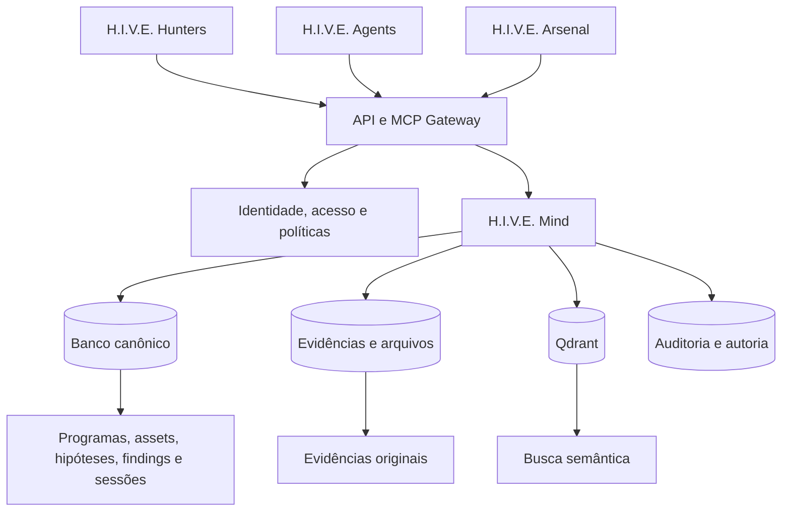

# Visão estratégica do H.I.V.E. Mind

## Definição provisória

H.I.V.E. Mind é a camada de inteligência compartilhada da H.I.V.E., responsável por armazenar, relacionar, recuperar e distribuir contexto autorizado entre pesquisadores, ferramentas e agentes. Seu objetivo é transformar conhecimento isolado em memória operacional coletiva, preservando autoria, proveniência, segurança e escopo, reduzindo retrabalho, custo computacional e duplicidade, enquanto aumenta precisão, continuidade e capacidade colaborativa.

## Princípio fundamental

> Toda operação autorizada deve aumentar o patrimônio de inteligência da organização.

Cada caça deve tornar a próxima caça melhor. O ativo não é apenas a quantidade de documentos acumulados, mas a capacidade de transformar conhecimento confiável, atualizado, atribuído e autorizado em melhores resultados operacionais.

## Proposta de valor para pesquisadores

Um pesquisador entra na H.I.V.E. para obter capacidades que não teria trabalhando sozinho. Em vez de começar toda investigação do zero, ele pode se beneficiar de:

- reconhecimento anterior;
- contexto produzido por outros pesquisadores e agentes;
- padrões e técnicas encontrados anteriormente;
- automações e infraestrutura compartilhadas;
- histórico de ativos, hipóteses e investigações;
- continuidade entre sessões, ferramentas, modelos e agentes.

```text
Pesquisador / Agente
        ↓
    H.I.V.E. Mind
        ↓
┌──────────────────────────────┐
│ Contexto histórico           │
│ Recon anterior               │
│ Findings                     │
│ Técnicas                     │
│ Hipóteses já testadas        │
│ Assets                       │
│ Conhecimento dos membros     │
│ Resultados de outros agentes │
└──────────────────────────────┘
        ↓
Nova investigação
        ↓
Novo conhecimento
        ↓
    H.I.V.E. Mind
```

## Hipótese de efeito de rede

```text
Mais membros
    ↓
Mais caçadas
    ↓
Mais recon + findings + técnicas
    ↓
Mais inteligência no H.I.V.E. Mind
    ↓
Ferramentas e agentes melhores
    ↓
Membros mais produtivos
    ↓
Mais resultados
    ↓
Maior valor da H.I.V.E.
```

Esse ciclo só se torna uma barreira competitiva quando o conhecimento acumulado possui qualidade, proveniência, controle de acesso e utilidade comprovada. Acumular dados sem curadoria pode gerar ruído, risco, informação obsoleta e vazamentos.

## Núcleo tecnológico da H.I.V.E.

| Componente | Responsabilidade |
| --- | --- |
| H.I.V.E. Mind | Memória, inteligência, contexto, proveniência e aprendizado coletivo. |
| H.I.V.E. Agents | Agentes especializados, coordenação, sessões e handoffs. |
| H.I.V.E. Arsenal | Ferramentas, scanners, automações e infraestrutura controlada. |
| H.I.V.E. Hunters | Julgamento humano, pesquisa, validação e produção de conhecimento. |

O Mind ocupa o centro. Agents e Arsenal consomem seu contexto e devolvem resultados estruturados. Hunters revisam, enriquecem e aprovam esses resultados, transformando-os em inteligência confiável.

## Papel deste repositório

O código atual pode provar o núcleo inicial do H.I.V.E. Mind: registrar conhecimento em uma operação e recuperá-lo de forma relevante em outra. A base técnica existente oferece MCP por `stdio`, Qdrant, embeddings locais com Ollama, busca híbrida, observação de arquivos, chunking, hashes, ingestão concorrente e CLI.

Não é necessário preservar os contratos do servidor RAG original. Seus componentes internos podem ser reutilizados ou substituídos conforme as necessidades do produto.

O Qdrant deve atuar como índice de recuperação, e não como fonte canônica de toda a empresa. Uma arquitetura futura deve separar:



- um banco canônico para membros, programas, assets, escopos, hipóteses, investigações, findings, autoria e permissões;
- armazenamento de objetos para evidências originais protegidas;
- Qdrant para representações derivadas usadas na recuperação semântica;
- uma camada de identidade, autorização, políticas e auditoria antes de qualquer acesso aos dados.

## Categorias de conhecimento

O produto deve separar claramente:

1. **Inteligência específica de um programa:** assets, endpoints, escopo e evidências, sempre isolados por autorização.
2. **Conhecimento técnico reutilizável:** técnicas, padrões de vulnerabilidade e metodologias sanitizadas.
3. **Estado operacional:** responsáveis, tarefas, hipóteses testadas, sessões e resultados.

Conhecimento técnico pode ser reutilizado quando estiver sanitizado e autorizado. Informações confidenciais de um alvo não podem atravessar programas por conveniência da busca.

## Incentivos e confiança

O desafio não é apenas técnico. Um pesquisador precisa saber por que deve contribuir com conhecimento que poderá beneficiar outras pessoas. A proposta precisa incluir:

- autoria e contribuição preservadas;
- crédito pelo conhecimento reutilizado;
- divisão econômica transparente;
- controle sobre quem acessa cada informação;
- proteção contra apropriação indevida;
- benefício operacional imediato em ferramentas e infraestrutura;
- separação rígida entre programas e clientes.

Sem incentivos, atribuição e confiança, o efeito de rede não se sustenta.

## Hipóteses a validar na v0.1

A primeira versão deve responder se contexto anterior torna uma investigação posterior mais rápida e precisa. As métricas iniciais são:

- tempo até encontrar contexto relevante;
- trabalho duplicado evitado;
- frequência de reutilização do conhecimento;
- precisão dos resultados recuperados;
- hipóteses descartadas graças ao histórico;
- findings que dependeram de inteligência acumulada;
- contribuição produzida e benefício recebido por membro;
- redução do volume de contexto e tokens enviados aos agentes.

## Avaliação atual

A visão é viável e possui um núcleo estratégico forte. Este repositório pode iniciar o H.I.V.E. Mind e testar seu ciclo de aprendizado. Para se tornar a infraestrutura central da empresa, precisará evoluir de um MCP com busca vetorial compartilhada para uma plataforma de inteligência com identidade, autorização, dados canônicos, proveniência, autoria, qualidade, incentivos e auditoria.

A barreira competitiva pretendida será a combinação de conhecimento exclusivo, confiança entre membros, qualidade acumulada, segurança, histórico operacional e capacidade de converter tudo isso em vantagem mensurável para cada hunter.
