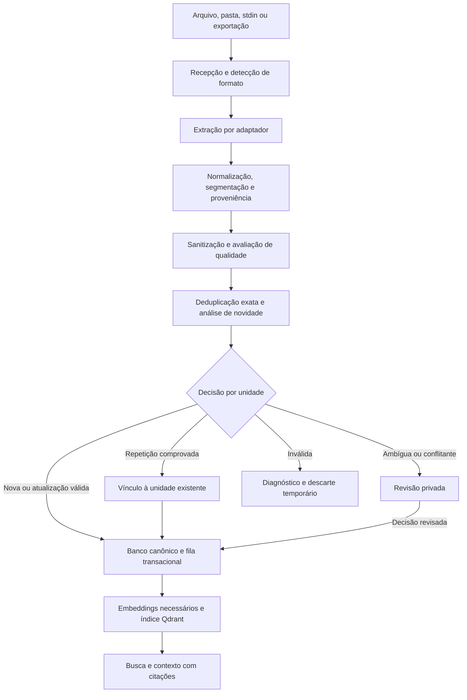

# Plano de melhoria do Hive Mind

Data: 15/09/2026. Base analisada: commit `961a3d7` e arquivos locais do projeto.

Estado: implementação iniciada em 15/09/2026. O diagnóstico abaixo registra a base anterior às mudanças; o andamento está na seção 16. Não representa validação dos serviços em produção nem medição do índice atual.

## 1. Objetivo e direção

Evoluir o Hive Mind para uma memória que recebe materiais em seus formatos de origem, identifica o conhecimento útil, preserva evidências e publica apenas unidades novas ou atualizações relevantes, sem multiplicar conteúdo repetido.

Neste plano, “mais expressivo” significa representar e comunicar melhor o conhecimento: o que sabemos, sobre qual ativo, com qual evidência, quando foi observado, o que mudou e o que ainda é hipótese. Isso inclui respostas melhores no MCP e na CLI, um modelo de dados mais rico e uma identidade de produto consistente.

O conversor proposto será uma camada de ingestão com adaptadores, normalização, avaliação de qualidade e deduplicação. “Ingerir qualquer coisa” será uma interface extensível: o usuário entrega o material sem reformatação manual; formatos suportados são convertidos e formatos desconhecidos recebem diagnóstico explícito. Não é uma promessa de interpretar corretamente qualquer binário.

Há duas garantias diferentes:

- **Duplicação exata:** garantir uma unidade canônica por conteúdo normalizado e contexto de isolamento, inclusive com writers concorrentes.
- **Equivalência de significado:** identificar candidatos, preservar diferenças e encaminhar incertezas para revisão. Similaridade vetorial não comprova que duas informações são iguais; ausência de duplicação também não comprova veracidade.

## 2. Como o projeto está hoje

### Base que deve ser aproveitada

O núcleo já possui Go, MCP local por `stdio`, embeddings com Ollama, Qdrant privado, papéis writer/reader, propriedade de documentos, controle de escopo aprovado, revisões, tombstones, auditoria e limites de ingestão. Há testes para publicação, falhas, isolamento e contratos.

Essa base permite evoluir progressivamente. A separação futura entre banco canônico, evidências e índice vetorial já aparece na [visão estratégica](docs/vision/hive-mind-strategic-vision.md).

### Diagnóstico com evidência no código

| Área | Situação observada | Consequência para o plano |
| --- | --- | --- |
| Formatos | `secureReadDocument` e `parseDocument`, em [server/revision.go](server/revision.go), aceitam `.md`, `.txt` e `.json`, com validação UTF-8 e limites. | Criar adaptadores de entrada; a existência de parsers legados em `ast/` não torna esses formatos disponíveis no fluxo atual. |
| Identidade | `SyncFileState` deriva `document_id` de Hive, programa e path; a revisão usa SHA-256 dos bytes e versões de parser/chunker. | Arquivo inalterado é idempotente, mas uma cópia em outro path pode gerar documento e embeddings adicionais. |
| Atualizações | Uma revisão alterada gera embeddings de todos os seus chunks antes da publicação. | Reutilizar unidades e embeddings que permanecerem iguais. |
| Deduplicação na busca | `deduplicateSearchPoints`, em [server/search.go](server/search.go), agrupa por documento e ordinal. | Remove candidatos repetidos do mesmo chunk; não elimina conhecimento equivalente entre documentos. |
| Busca híbrida | `queryVariant`, em [server/worker.go](server/worker.go), implementa dense, sparse e fusão RRF; [server/config.go](server/config.go) fixa `SearchMode: "dense"` na configuração observada. | Tornar o modo configurável e verificável; medir o caminho realmente usado. |
| Componente lexical | `ComputeSparseVector` usa hash de termos e frequência ponderada pelo tamanho do termo. | Não descrevê-lo como BM25 completo; comparar alternativas com um conjunto de avaliação. |
| Lotes | `SyncWorkspace` continua processando os jobs após erro individual, mas retorna somente `firstErr`; retornos sem mudança também incrementam `Ingested`. | Distinguir criado, atualizado, inalterado, duplicado, ignorado e falhou; fornecer todos os diagnósticos do lote. |
| Watcher | [server/watcher.go](server/watcher.go) encaminha Write/Create/Remove, sem tratar explicitamente Rename. | Cobrir renomeações e reconciliação, mantendo carência e tombstones previstos no contrato. |
| Qualidade das respostas | A busca limita o total, sem cota por documento; `chunkMarkdown` inclui front matter/título nas seções. | Melhorar diversidade e reduzir metadados repetidos no contexto. |
| Expressividade | [server/metadata.go](server/metadata.go) modela tipos, tags, classificação, fonte, data e ativos; faltam unidades explícitas para hipóteses, afirmações e relações. | Ampliar o modelo preservando a distinção entre evidência e inferência. |
| Maturidade | [docs/spec/status.json](docs/spec/status.json) mantém specs 06–08 pendentes. | Não tratar implantação, recuperação e ensaio entre máquinas como comprovados apenas por testes unitários. |

O [TODO.md](TODO.md) contém relatos úteis de uso real, mas alguns precisam de reconciliação com o código: o lote atual não interrompe todos os jobs no primeiro erro e a implementação híbrida existe. Os relatos de baixa relevância e segredos no corpus justificam avaliação e sanitização; não foram reproduzidos nesta análise.

## 3. Experiência desejada

O usuário entrega uma pasta, arquivo, texto de terminal ou exportação de ferramenta, informa o programa e recebe um resumo compreensível:

```text
Importação concluída com pendências
12 fontes analisadas
85 unidades candidatas:
  40 novas, publicadas
  30 duplicatas exatas, vinculadas a unidades existentes
   5 novas evidências para conhecimento existente
   4 atualizações temporais, preservadas no histórico
   3 conflitos, aguardando revisão
   2 extrações incertas, aguardando revisão
   1 unidade rejeitada, com motivo registrado
```

Exemplo ilustrativo, sem relação com medições do corpus atual. Contagens de fontes, unidades, vínculos e vetores devem ser apresentadas separadamente.

Uma consulta sobre um ativo passa a apresentar:

- resumo factual com citações;
- observações atuais e histórico de mudanças;
- hipóteses e conflitos identificados como tais;
- evidências, autores e datas;
- lacunas de informação e estado do escopo aprovado.

Começar por CLI/MCP. Uma interface visual de revisão e uma linha do tempo podem vir depois dos contratos e métricas, sem bloquear o conversor inicial.

## 4. Arquitetura proposta



### Responsabilidades e persistência

1. **Recepção temporária:** processar os originais sem exigir que o usuário os reorganize em `programs/<id>/`. Programa, origem e classificação vêm do contexto confiável da importação; conteúdo do arquivo não pode conceder permissões. A entrada transitória fica fora da pasta observada e não é pesquisável.
2. **Banco canônico:** armazenar unidades, revisões, relações, proveniência e decisões. Proposta para a fase com múltiplos writers: PostgreSQL compartilhado, acessado por uma camada autenticada de ingestão. A unicidade deve ser uma restrição do banco, não uma consulta seguida de inserção sem proteção.
3. **Evidências:** por padrão, referenciar a origem e registrar hash/localizador. Quando retenção de originais for necessária, guardar uma cópia por hash e domínio de acesso em armazenamento privado, com política explícita. Duplicatas não criam novas cópias do blob. Referências a arquivos locais devem indicar quando não são acessíveis a outro dispositivo.
4. **Qdrant:** manter representações derivadas para busca; tornar possível reconstruí-las a partir do conteúdo canônico admitido.
5. **Revisão:** guardar apenas o necessário para decidir, com acesso restrito e prazo de retenção. Itens pendentes não entram na busca normal. Descartar arquivos temporários após conclusão; registrar motivo e identidade sem conteúdo sensível no log.

A introdução do banco e da camada compartilhada é uma mudança arquitetural planejada, com custo de operação, autenticação e backup. Não basta criar um SQLite em cada dispositivo para garantir unicidade entre todos os writers.

Como fundamento técnico, PostgreSQL oferece unicidade composta e tratamento de colisões de inserção com `ON CONFLICT`. O desenho de tabelas, autorização e transações ainda precisa ser implementado e testado. Fontes: [índices únicos](https://www.postgresql.org/docs/current/indexes-unique.html) e [INSERT / ON CONFLICT](https://www.postgresql.org/docs/current/sql-insert.html).

## 5. Modelo de conhecimento mais expressivo

Separar quatro objetos:

| Objeto | Papel | Exemplos de campos |
| --- | --- | --- |
| Fonte | Identificar de onde veio o material e quem o publicou. | `source_id`, writer, URI/path relativo, `raw_hash`, formato, revisão, data da coleta. |
| Unidade de conhecimento | Armazenar conteúdo admitido uma vez dentro do seu domínio de acesso. | `unit_id`, tipo, título, corpo normalizado, entidades, hash canônico, versão. |
| Evidência/ocorrência | Vincular a unidade à passagem que a sustenta. | fonte/revisão, página, linha, JSON Pointer, planilha/célula ou tempo de mídia. |
| Relação | Explicar conexões e evolução. | `supports`, `contradicts`, `supersedes`, `derived_from`, `related_to`. |

Tipos iniciais: observação, evidência, hipótese, procedimento e resultado. Não transformar toda frase em “fato confirmado”. Afirmações extraídas automaticamente permanecem observações ou hipóteses até satisfazerem a política do tipo.

Campos comuns obrigatórios: `schema_version`, `hive_id`, `program_id`, classificação, domínio de acesso, origem, versão do extrator/normalizador e estado de validação. Campos não inferíveis ficam desconhecidos ou pendentes; não inventar autor, coleta ou validade.

Manter separados `observed_at` (quando ocorreu), `ingested_at` (quando entrou), validade temporal e estado de revisão. Uma observação recente não invalida automaticamente uma anterior.

Relações podem começar como tabelas e referências; um banco de grafos não é pré-requisito. `effective_scope_status` continua exclusivamente derivado do manifesto aprovado, nunca de resumo, OCR, modelo ou score de qualidade.

## 6. Conversor: formatos e processamento

### Cobertura por ondas

| Onda | Entradas | Entrega esperada |
| --- | --- | --- |
| Inicial | Markdown, TXT, JSON, JSONL/NDJSON, CSV, TSV, listas de URLs/hosts, texto via stdin. | Extração determinística, streaming para registros e tabelas, preservação de estrutura e localização. |
| Documentos | HTML salvo, PDF com texto, DOCX, XLSX. | Seções, páginas, células e tabelas; diagnóstico explícito de extração parcial. |
| Ferramentas e código | HAR, relatórios XML/JSON de ferramentas, logs e arquivos de código. | Adaptadores por schema; registros estruturados; uso avaliado dos parsers existentes em `ast/`. |
| Multimodal | Imagens/PDF digitalizado, áudio e vídeo. | OCR/transcrição com página/região/timestamp e indicação de incerteza. |
| Conectores | URLs, APIs, repositórios e arquivos compactados. | Credenciais por conector, limites de rede/descompactação, checkpoints e versões de origem. |

Cada adaptador declara formatos, versão, limites, fidelidade e recursos necessários. Detecção combina extensão, assinatura e validação do parser; não confiar apenas no nome do arquivo. Dependências de PDF/OCR/transcrição serão escolhidas após testes com amostras representativas.

### Pipeline por fonte

1. Validar contexto de importação, acesso, tamanho e tipo; obter hash dos bytes. Usar streaming quando o formato permitir.
2. Verificar se essa fonte/revisão já foi processada com as mesmas versões de política e conversor.
3. Extrair blocos com localizadores e estrutura, sem executar conteúdo incorporado.
4. Normalizar de maneira específica ao formato e segmentar em unidades antes de gerar janelas de recuperação.
5. Detectar dados sensíveis; produzir representação sanitizada antes de qualquer embedding ou modelo. Se a sanitização destruir o sentido, manter pendente para revisão.
6. Validar qualidade, verificar duplicação e classificar a novidade de cada unidade.
7. Preparar a revisão da fonte com todos os seus vínculos e publicar conforme o protocolo de consistência.
8. Retornar relatório, liberar recursos temporários e permitir retomada idempotente.

Arquivos grandes devem produzir registros/seções com memória limitada e checkpoints. Aumentar indefinidamente `HIVE_MAX_FILE_BYTES` ou cortar os primeiros N caracteres não resolve ingestão de dumps.

A normalização deve preservar o significado: não remover negações, números, diferenças de caixa em paths, parâmetros de URL ou ordem de arrays indiscriminadamente. Identificar tabelas, blocos de código e cabeçalhos antes de simplificar espaços. Front matter fica em metadados; contexto necessário da seção continua disponível.

## 7. Deduplicação e controle de novidade

### Nível 1 — Reprocessamento da mesma fonte

Comparar identidade da fonte, revisão/hash bruto, contexto de acesso e versões do pipeline. Reimportar a mesma entrada não adiciona unidades, ocorrências ou trabalhos de embedding. A mesma entrada deve poder ser reavaliada após mudança de sanitização ou normalização.

### Nível 2 — Conteúdo normalizado idêntico

Calcular SHA-256 da representação canônica da unidade, incluindo qualificadores que mudam seu significado. A chave de unicidade proposta é:

```text
(hive_id, program_id, access_partition,
 classification, unit_kind, normalizer_version, canonical_hash)
```

Todos os componentes da chave devem ter representação definida, sem nulidade ambígua. Tempo/ambiente/entidade entram na representação quando fazem parte da afirmação; um horário de importação não deve tornar uma duplicata artificialmente nova.

Confirmar a igualdade do conteúdo canônico quando houver colisão de hash. Persistir a unidade uma vez e acrescentar apenas vínculos novos de proveniência. Um arquivo renomeado preserva identidade de conteúdo, ainda que a localização da fonte seja atualizada.

Não deduplicar conteúdo nem compartilhar cache entre programas/classificações de forma que revele a existência de dados restritos. Unicidade é deliberadamente limitada ao domínio autorizado.

### Nível 3 — Sobreposição parcial e repetição estrutural

Deduplicar blocos/registros antes do chunking com sobreposição. Se um relatório repete 90% do anterior e acrescenta uma observação, vincular os blocos existentes e publicar a novidade, sem perder os cabeçalhos e qualificadores que a explicam.

Janelas sobrepostas são projeções de recuperação, não novas unidades canônicas. Sua repetição técnica não deve ser contabilizada como novo conhecimento.

### Nível 4 — Equivalência semântica

Recuperar candidatos dentro do mesmo domínio de acesso, usando semelhança lexical e vetorial. Comparar entidades, predicados, valores, polaridade, condições e tempo. Similaridade serve para selecionar pares a analisar; não é autorização para descartar um deles.

| Situação | Decisão |
| --- | --- |
| Conteúdo idêntico, mesma ocorrência | Nenhuma nova unidade ou ocorrência. |
| Conteúdo idêntico, outra fonte válida | Reutilizar unidade e registrar a nova proveniência. |
| Paráfrase comprovadamente equivalente | Vincular à unidade existente e preservar passagem de origem; inicialmente exigir revisão. |
| Mesma afirmação com evidência independente | Acrescentar evidência; não duplicar a afirmação. |
| Informação complementar | Criar unidade relacionada ou revisão explícita, preservando o incremento. |
| Mudança de estado ao longo do tempo | Criar observação temporal e relação com o histórico. |
| Afirmação contraditória | Preservar candidatos e evidências em revisão; após decisão, publicar conflito explicitamente. |
| Similaridade ambígua ou extração insegura | Manter pendente, sem descarte automático e sem busca normal. |

Um modelo pode sugerir relações e extrair campos, sempre com citações e validação do schema. Não deve preencher lacunas nem decidir sozinho a exclusão de conteúdo. Calibrar limiares por tipo/idioma com pares rotulados; nenhum limiar universal será tratado como garantia.

No MVP, a garantia automática cobre igualdade canônica. Paráfrases e conflitos entram na fila de revisão; isso prioriza evitar perda de informação inédita, com o custo explícito de revisão humana.

## 8. Qualidade como política verificável

Avaliar separadamente validade do formato, qualidade da extração, completude do contexto, proveniência, sensibilidade, novidade e adequação temporal. Evitar um score único que aparente certificar a verdade.

Regras iniciais:

- rejeitar unidades vazias ou sem conteúdo recuperável;
- exigir origem e localizador para evidência verificável;
- manter extração parcial, OCR incerto e classificação indefinida como pendências;
- impedir segredos em texto puro na representação pesquisável; logs armazenam motivos e contadores;
- não aceitar autoridade, instruções ou aprovação de escopo vindas do conteúdo ingerido;
- manter observações breves e válidas: baixa extensão não significa baixa qualidade;
- preservar negativos e conflitos úteis; número de cópias não aumenta confiança;
- distinguir uma fonte independente de uma cópia que cita a mesma fonte original;
- oferecer revisão, correção e desfazimento de fusões com histórico.

Registrar `decision`, `reason_codes`, versão da política, unidades relacionadas e identidade do revisor quando houver. Decisões possíveis: nova, duplicata, evidência adicional, atualização, revisão necessária e rejeitada.

Formatos ampliados exigem limites de CPU, memória, tempo e descompactação; parsers não executam scripts ou macros. Conectores de URL precisam limitar destinos e redirects para evitar acesso indevido a serviços internos. Esses controles pertencem ao adaptador e devem ser testados quando ele for introduzido.

## 9. Concorrência, publicação e exclusão

O conversor deve ficar no caminho comum de CLI, watcher e MCP. Um caminho de ingestão direta que ignore a política comprometeria a garantia do novo índice.

Para a fase compartilhada:

1. Transação no banco registra a fonte/revisão preparada, cria ou reutiliza unidades por chave única e grava os vínculos e uma fila transacional de indexação.
2. Um worker consome essa fila com reexecução segura, gera embeddings faltantes e grava os pontos de IDs determinísticos no Qdrant.
3. Verifica os pontos necessários e ativa a revisão canônica. A busca valida a geração ativa antes de retornar dados, inclusive quando o índice ainda estiver convergindo.
4. Falha anterior à ativação mantém a revisão anterior visível. Falha posterior deixa limpeza/reconciliação pendente, sem reativação silenciosa de versões antigas.

Banco e Qdrant não formam uma transação única: a fila transacional e a reconciliação tornam essa diferença explícita. Processamento pode se repetir; o efeito persistido precisa ser idempotente. Um cache de embeddings usa conteúdo exato enviado ao modelo, digest do modelo, configuração e domínio de acesso.

Uma fonte continua pertencendo ao seu writer. A unidade compartilhada é imutável e referenciada por fontes; outro writer pode acrescentar sua evidência, mas não alterar autoria ou apagar os vínculos alheios. Mudança de conteúdo cria versão/unidade conforme a política.

Remover uma fonte desativa seus vínculos. Remover fisicamente uma unidade e seus vetores exige ausência de referências ativas, política de retenção e tombstone. Desfazer uma fusão restaura os vínculos às unidades corretas. Uma fonte excluída não pode ressurgir apenas porque um job antigo foi repetido.

Testar especialmente a primeira inserção simultânea da mesma unidade por dois writers; consultar antes de inserir ou ter mutex local não resolve a corrida entre máquinas.

## 10. Recuperação e expressão do conhecimento

1. Expor modo de busca na configuração validada e no estado operacional. Comparar dense, sparse e hybrid no corpus de avaliação antes de mudar o padrão.
2. Aproveitar a fusão RRF já implementada e testar filtros nas duas buscas. Qdrant documenta a composição de prefetches e fusão em [Hybrid Queries](https://qdrant.tech/documentation/search/hybrid-queries/); isso oferece o mecanismo, não comprova relevância para este corpus.
3. Agrupar resultados por unidade canônica e limitar contribuição por fonte; expandir evidências sob demanda.
4. Oferecer orçamento de contexto, evitar preencher slots com resultados fracos e medir tokens com tokenizer definido quando necessário. Caracteres e bytes continuam métricas distintas.
5. Retornar título, trecho útil, tipo, data, estado de validação, relações e referências compactas. Metadados completos podem ser consultados por ID.
6. Compor resumos com citações apenas do material autorizado recuperado; indicar quando a evidência é insuficiente e manter `untrusted_content: true`.
7. Padronizar nome “Hive Mind”, descrições das ferramentas e mensagens de erro; a identificação MCP ainda usa `go-qdrant-sync-mcp`.

Exemplos de comandos futuros, ainda não implementados:

```text
hive-mind import <caminho> --program=<id> --dry-run
hive-mind import <caminho> --program=<id>
hive-mind import --stdin --format=jsonl --program=<id>
hive-mind import report <job-id>
hive-mind review list --program=<id>
hive-mind knowledge show <unit-id>
```

`--dry-run` não publica unidades nem vetores e apresenta decisões propostas; se a análise usar índice/modelo, informa essa dependência. A execução revalida a unicidade porque outra importação pode ter ocorrido depois da prévia.

Ferramentas MCP futuras: importação, acompanhamento e consulta de unidade. Escrita permanece restrita a writers; programa, classificação e acesso são validados pelo servidor. Preservar `hive_search` e `hive_get_context` durante a transição com extensões compatíveis ou contratos versionados.

## 11. Organização sugerida do código

Extrair responsabilidades gradualmente, com testes de contrato entre módulos:

```text
internal/
  ingestion/     # orquestração, jobs, limites e resultados por item
  converters/    # adaptadores de formatos e detecção
  knowledge/     # unidades, fontes, relações e revisões
  normalize/     # normalização determinística por tipo
  dedup/         # igualdade, candidatos e decisões de novidade
  quality/       # políticas, sanitização e motivos
  storage/       # persistência canônica, evidências e fila transacional
  retrieval/     # projeções, diversidade e composição de contexto
server/          # contratos e integração CLI/MCP existentes
```

Portas pequenas: conversor recebe stream e contexto, emite blocos localizáveis; normalizador produz unidades determinísticas; deduplicador devolve decisão e referência; persistência aplica decisão atomicamente. Cancelamento, erros tipados e versões fazem parte dos contratos.

Evitar ampliar `server/worker.go` e `server/revision.go` com todos os formatos e regras. Reaproveitar o protocolo atual de revisão como referência de comportamento, adaptando-o para referências compartilhadas.

## 12. Roadmap e critérios de aceite

As fases são ordenadas por dependências; duração e custo devem ser estimados após a linha de base. Itens marcados foram implementados; os demais permanecem pendentes.

### Fase 0 — Linha de base e contratos

- [x] Inventariar formatos, tamanhos e duplicatas exatas em cópia controlada do corpus, sem publicar conteúdo sensível.
- [x] Criar amostras sanitizadas e pares rotulados: duplicata, complemento, contradição e mudança temporal.
- [x] Medir recuperação, repetição no top-k, custo de embeddings e tempo de ingestão.
- [x] Reconciliar README/TODO/specs com os caminhos executados; registrar pendências operacionais.
- [x] Especificar unidade canônica, domínio de deduplicação, retenção e contrato dos adaptadores.

Aceite: benchmark reproduzível, critérios de qualidade explícitos e decisão arquitetural de persistência registrada.

### Fase 1 — Base atual mais utilizável

- [x] Relatório completo de lote com resultados tipados e contagem de arquivos inalterados.
- [ ] Tratar Rename e reconciliar ausências sem violar carência/propriedade.
- [ ] Expor configuração de busca e adicionar avaliação do ranking/diversidade.
- [ ] Extrair interfaces de ingestão e prévia `--dry-run` para formatos atuais.
- [ ] Melhorar mensagens e identidade da CLI/MCP.

Aceite: um arquivo inválido não oculta o resultado dos demais; falha parcial permanece explícita; contratos existentes continuam passando. Sem alegar unicidade global nesta fase.

### Fase 2 — MVP do conversor com deduplicação exata

- [ ] Implementar fonte, unidade, ocorrência, domínio de acesso e unicidade transacional compartilhada.
- [ ] Implementar fila de indexação, retomada, projeção vetorial e validação de revisão ativa.
- [ ] Adaptadores de MD/TXT/JSON/JSONL/CSV/TSV/stdin e listas estruturadas.
- [ ] Normalização conservadora, sanitização e decisões por unidade.
- [ ] Proveniência múltipla, reutilização de embeddings, remoção por referências e relatórios.
- [ ] Integrar os três pontos de entrada ao mesmo pipeline para o índice novo.

Aceite: reimportar o mesmo lote não aumenta unidades, ocorrências ou embeddings de conteúdo; duas cópias em paths diferentes geram uma unidade e duas fontes; escritores concorrentes convergem sem perder proveniência. Sondagens de infraestrutura, se existirem, são medidas separadamente.

### Fase 3 — Documentos e conhecimento relacionado

- [ ] PDF textual, HTML, DOCX/XLSX e primeiros adaptadores de ferramentas.
- [ ] Hipóteses, observações temporais, evidências e relações.
- [ ] Deduplicação parcial e candidatos semânticos com fila de revisão.
- [ ] Consulta por unidade, contexto compacto e desfazimento de fusões.

Aceite: documentos com repetição parcial publicam só incrementos; conflitos e mudanças temporais permanecem distinguíveis; toda unidade aponta para evidência localizável.

### Fase 4 — Expansão controlada

- [ ] OCR, transcrição e conectores conforme demanda medida.
- [ ] Calibrar sugestões semânticas por formato/idioma; só ampliar automação após avaliação de falsos agrupamentos.
- [ ] Interface de revisão, histórico e qualidade por programa.
- [ ] Avaliar reranker/modelo lexical ou de embedding com migração de índice versionada.

Aceite: cada novo adaptador tem cobertura declarada, limites, testes adversariais, avaliação de fidelidade e efeito mensurado no conjunto de consulta.

## 13. Migração do acervo existente

1. Inventariar fontes acessíveis e reconciliar o estado das revisões atuais. Quando o original estiver indisponível, registrar essa limitação; chunks sobrepostos não devem ser considerados originais completos por suposição.
2. Fazer backup verificável de documentos, dados e controle antes de qualquer migração; incluir banco canônico e evidências na estratégia nova.
3. Executar conversão em modo de análise e apresentar duplicatas, pendências, referências propostas e diferenças de contagem.
4. Construir banco e collection de destino versionados, mantendo a consulta atual disponível durante a avaliação.
5. Reprocessar preferencialmente as fontes originais, preservando writers, classificação, histórico e aprovações. Não fundir `scope.json` de programas distintos nem produzir aprovação automática.
6. Comparar busca antiga e nova com consultas fixas; verificar isolamento, proveniência, perda de informação e exclusão.
7. Fazer corte controlado com pausa de novas escritas, reconciliação final e apontamento para o destino validado. Se for necessário migrar sem pausa, implementar antes um registro de mudanças reproduzível.
8. Manter a versão anterior durante uma janela definida. Se houver novas escritas após o corte, o rollback exige preservá-las/reaplicá-las; voltar apenas a collection antiga perderia esse incremento.

Nenhuma limpeza física do acervo atual faz parte da criação deste plano. A deduplicação futura deve preservar conhecimento e autoria; redução do número de vetores, isoladamente, não é prova de sucesso.

## 14. Validação e métricas

### Cenários obrigatórios

- Mesmo arquivo repetido, copiado, renomeado e ingerido simultaneamente por writers diferentes.
- JSON com ordem de chaves diferente; arrays com ordem significativa; URLs com parâmetros distintos.
- Texto quase igual com negação, número, ativo, condição ou data diferente: não fundir automaticamente.
- Relatório extenso com uma seção nova: preservar a novidade e reutilizar o restante.
- Mesma afirmação em fontes independentes versus espelhos da mesma origem.
- Classes/programas diferentes: não compartilhar unidade ou revelar candidato restrito.
- CSV/JSONL grandes, arquivo malformado, PDF parcial, cancelamento e falha de parser.
- Segredos, conteúdo com instruções maliciosas, caminhos externos e arquivos compactados abusivos conforme adaptadores.
- Falha antes/depois de commit, indisponibilidade de Qdrant/modelo/banco, retry e jobs antigos após tombstone.
- Exclusão de uma entre várias fontes, remoção da última referência e desfazimento de fusão.

### Indicadores e metas de aceite iniciais

| Indicador | Critério proposto |
| --- | --- |
| Idempotência | Zero novas unidades/ocorrências em reimportação idêntica concluída. |
| Duplicação exata | Uma unidade por chave canônica em testes concorrentes; duas fontes não geram dois corpos canônicos. |
| Preservação de novidade | Nenhuma perda nos casos rotulados de negação, complemento, contradição e mudança temporal. |
| Rastreabilidade | 100% das unidades admitidas com origem e localizador ou limitação de origem explicitamente aprovada. |
| Segurança | Zero retornos fora do domínio autorizado e zero segredos das fixtures no índice/logs. |
| Recuperação | Comparar Recall@k e MRR, com definições e consultas fixas; não regredir em consultas críticas. |
| Diversidade | Medir proporção de unidades repetidas no top-k e quantidade de fontes úteis. |
| Eficiência | Medir bytes recebidos, unidades candidatas/admitidas, embeddings evitados, latência p50/p95 e uso de memória. |
| Revisão | Medir volume pendente, idade da fila, falsos agrupamentos e falsos negativos em amostra rotulada. |

As metas são critérios futuros, não resultados obtidos. Para semântica, relatar tamanho da amostra e erros observados; zero erros em um conjunto finito não comprova perfeição universal.

Cada mudança comportamental deve incluir testes apropriados, conforme [a decisão de testes obrigatórios](docs/decisions/001-tests-are-required.md). Rodar `go test ./...` e verificações relevantes na implementação; fluxos de banco/Qdrant e concorrência precisam de integração real. A criação inicial deste plano alterou apenas documentação; a validação das implementações está registrada abaixo.

## 15. Primeira entrega recomendada

Começar pela linha de base e pelos relatórios de ingestão, em seguida implementar o MVP com normalização conservadora, deduplicação exata de unidades e proveniência múltipla. Isso torna a redução de repetição mensurável e prepara o sistema para formatos adicionais e análise semântica.

O resultado esperado é um Hive Mind que explica o que recebeu, o que aproveitou e por quê, mantém cada conhecimento admitido uma vez no seu domínio de acesso e conserva as evidências necessárias para verificá-lo.

## 16. Andamento da implementação

### Entrega 1 — Relatório de ingestão (15/09/2026)

Implementados [contrato v1](docs/spec/contracts/ingestion-report.md), [tipos e integração de relatório](server/ingestion_report.go) e [testes de regressão](server/ingestion_report_test.go).

- Resultados individuais e ordenação determinística com workers concorrentes.
- Contadores de criados, atualizados, inalterados, ignorados, ausentes, falhos e cancelados.
- CLI e MCP preservam o relatório quando parte do lote falha; a poda não executa nessa situação.
- Motivos explícitos por etapa, incluindo tamanho/chunks, embedding e publicação com limpeza pendente.
- Publicação confirmada distinguida de falha de processamento; nenhuma deduplicação entre arquivos é alegada nesta entrega.
- TODO reconciliado nos relatos de interrupção de lote e disponibilidade da busca híbrida.

Linha de base automatizada: `go test ./...` passou antes das alterações, usando caches em `/tmp`. Os testes novos usam fontes sintéticas e serviços simulados; não foi executada ingestão do acervo privado nem migração de collections.

Validação da entrega: `go test ./... -count=1`, `go vet ./...` e `go test -race ./server -run 'TestIngestion|TestMultiWriter|TestSpec002' -count=1` passaram. Executados com `GOCACHE=/tmp/hive-mind-go-cache` e `GOMODCACHE=/tmp/hive-mind-modcache`. A spec operacional 07 foi atualizada para 1.2.0, mantendo o aceite de implantação como `pending`.

Próxima entrega prevista: inventário reproduzível de formatos/tamanhos/duplicação exata e contratos do conversor, acompanhados da avaliação de recuperação. O restante das fases 0 e 1 segue pendente.

### Entrega 2 — Inventário local e amostras (15/09/2026)

- Implementado `inventory <dir>`, sem configuração ou serviços, com relatório JSON determinístico de formatos, tamanhos e cobertura de hashes.
- Duplicatas integrais candidatas agrupadas somente dentro do mesmo programa; caminhos opcionais e nenhum conteúdo/hash exportado.
- Leitura delimitada, políticas de exclusão locais, recusa de symlinks/arquivos especiais e detecção de alterações durante leitura.
- Adicionada amostra sintética com cinco pares rotulados: duplicata, complemento, contradição, mudança temporal e cópia entre programas.
- Documentados [contrato do inventário](docs/spec/contracts/inventory-report.md) e [proposta do conversor](docs/spec/contracts/converter-pipeline.md).
- Executado inventário em cópia controlada: 100 arquivos, 25.343.943 bytes, 16 vazios; o único grupo de repetição integral reúne esses vazios, com zero bytes repetidos. [Linha de base](docs/operations/inventory-baseline.md).

A proposta de contrato não ativa novos formatos na ingestão. Deduplicação de trechos/semântica continua pendente; a decisão de persistência/retenção e a avaliação de recuperação foram fechadas na Entrega 3.

### Entrega 3 — Linha de base de recuperação, reconciliação e contratos (16/09/2026)

Fecha as três pendências da Fase 0.

- **Benchmark offline reproduzível** ([contrato](docs/spec/contracts/eval-report.md), [resultados](docs/operations/retrieval-baseline.md)): harness em [server/eval.go](server/eval.go) executado por `TestRetrievalBaseline`, com Qdrant em memória que pontua (cosseno, esparso, RRF) e embedder sintético bag-of-words. Corpus de 13 arquivos e 11 consultas rotuladas em `server/testdata/eval/`. Mede Recall@k, MRR, documentos distintos e maior fração de um documento no top-k, bytes de prefixo repetido por chunk, chamadas/bytes de embedding e tempo de ingestão e reingestão. Contadores de embedding foram adicionados ao worker (`SnapshotEmbeddingStats`), sem alterar o relatório de ingestão v1.
- **Achados estruturais:** 34% do texto indexado nas fixtures é front matter + título repetido por seção; um documento longo ocupou 8/8 resultados em duas consultas; a reingestão sem mudanças fez zero chamadas de embedding; documentos sem `classification` (`.txt`/`.json` sem o campo) são embedados e nunca devolvidos pela busca. Recall/MRR reportados descrevem o embedder sintético e não o modelo real — a execução com Ollama/Qdrant reais fica para a Fase 1.
- **Reconciliação:** README corrige a alegação de busca híbrida ativa, documenta nove variáveis de ambiente ausentes e o requisito de `classification`; `help` lista as três flags omitidas; TODO ganha cabeçalho de histórico, corrige o item de híbrido e anota as medições; subcomando morto `evaluate-search` removido. Pendências operacionais consolidadas em [implementation-status.md](docs/operations/implementation-status.md).
- **Contratos e decisão:** [canonical-unit.md](docs/spec/contracts/canonical-unit.md) define objetos, identidades UUID v5, chave de unicidade com `access_partition`, separação `observed_at`/`ingested_at`, retenção, contrato dos adaptadores e `reason_codes`; a [decisão 003](docs/decisions/003-canonical-persistence.md) fixa PostgreSQL compartilhado como fonte canônica com fila transacional, Qdrant como índice derivado e proíbe alegar unicidade global antes disso.

Validação: `go build ./...`, `go vet ./...`, `go test ./... -count=1` e `gofmt -l` limpos, com `GOCACHE=/tmp/hive-mind-go-cache` e `GOMODCACHE=/tmp/hive-mind-modcache`. Nenhuma spec numerada foi alterada; `status.json` permanece como estava.

Próxima entrega: extração de blocos localizáveis para MD/TXT/JSON e normalização determinística conforme o contrato dos adaptadores, com preservação da publicação atual (Fase 1: interfaces de ingestão e `--dry-run`).

### Entrega 4 — Conversor versionado e ingestão em um passo (18/09/2026)

- Adaptadores MD/TXT/JSON/JSONL/NDJSON/CSV/TSV e stdin produzindo o envelope `hive-document/v1` com blocos localizáveis, números JSON exatos, tabelas com cabeçalho/células e limites agregados (`server/converter.go`, `server/convert_cli.go`; commit `b80dc1d`).
- Fluxo em um passo `convert --ingest`: converte offline e publica o envelope no Qdrant na mesma invocação, exigindo writer e `--output` dentro de `HIVE_DATA_DIR/programs/<id>/`. Reusa o pipeline existente (`IngestPathReport` → `syncFileResult`), preservando identidade por path, idempotência e propriedade por writer. Relatório de ingestão v1 inalterado.
- Correções de base: `docs/spec/status.json` reconciliado com a spec 02 (v1.2.0, sha256 e proveniência); `bin/hive-mind` removido do versionamento e `bin/` adicionado ao `.gitignore` (docs já instruem `go build`).
- Testes: `server/convert_cli_test.go` cobre parsing de `--ingest`, publicação e idempotência de arquivo único, e negação para reader (código 12).

Validação: `go build ./...`, `go vet ./...`, `gofmt -l` limpos e `go test ./... -count=1` verde (inclui `tests/spec_status_test.go`), com `GOCACHE`/`GOMODCACHE` em `/tmp`.

Fora de escopo desta entrega (mantidos como pendentes): adaptadores binários (PDF/DOCX/HTML/XLSX), normalização/admissão canônica, deduplicação semântica e sanitização de segredos — Fases 2–4 e decisão 003.
